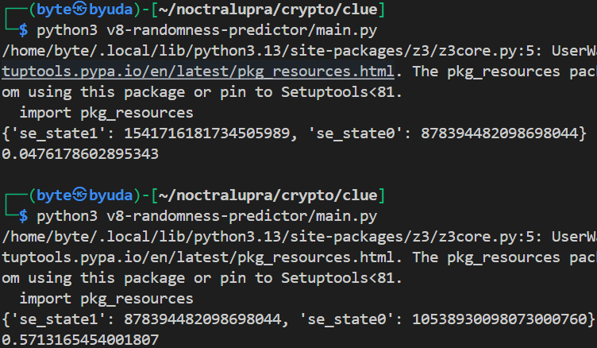

## clue
**Difficulty:** Medium
**Author:** n4siKvn1ng
**Connection:** nc ctf.noctralupra.space 10319

### Description
Lima angka pertama adalah gema dari masa lalu, dua angka terakhir, yang tak terucap, adalah benih dari takdirmu. Apakah kamu termasuk orang yang bisa menentukan takdir sendiri?

### Solution
* The 5 Cosmic Numbers (clue):

```json
[
  0.6644429483477989,
  0.3856619959965697,
  0.7698624197937538,
  0.5352585532999485,
  0.08357660167963021
]
```

* RSA public key and ciphertext (from menu “Give the flag”):

```text
N = 15887396264177417605250873134015355221000840933953912887695849516406848790376414747835245059473727919347815116203208647592420123966675130815988458230165131

e = 65537

c = 5089560475769346323083746826614564985736605749064246822234568173137966110489397126520990430822449038000366291523300789763111136460448864045342320523881054
```

Nilai diatas adalah output dari service yang disediakan oleh chall. Dan kode dibawah adalah source codenya.

```js
const randomValues = Array.from(Array(7), Math.random);
const publicValues = randomValues.slice(0, 5); // dipublikasi
const secretVal6 = randomValues[5];            // disembunyikan
const secretVal7 = randomValues[6];            // disembunyikan

const primeSeed = secretVal6.toString() + secretVal7.toString();
const p = generateSeededPrime(256, primeSeed + "p");
const q = generateSeededPrime(256, primeSeed + "q");
```

Pada source code-nya `chall.js` memanggil `Math.random()` sebanyak **7 kali** di awal proses, lima nilai pertama ditunjukkan sebagai **The 5 Cosmic Numbers**, sedangkan **nilai ke‑6** dan **ke‑7** disembunyikan. Kedua nilai rahasia tersebut digabung dalam bentuk **string desimal** (`secretVal6.toString() + secretVal7.toString()`) dan digunakan sebagai **seed** untuk `seedrandom`, lalu dipakai untuk menghasilkan dua **bilangan prima 256‑bit** (`p` dan `q`) melalui fungsi `generateSeededPrime(bits, seed)`.

```js
function generateSeededPrime(bits, seed) {
  const rng = seedrandom(seed);
  while (true) {
    let p = bigInt(1);
    for (let i = 0; i < bits; i++) {
      p = rng() > 0.5 ? p.shiftLeft(1).or(1) : p.shiftLeft(1);
    }
    p = p.or(1); // paksa ganjil
    if (isPrime(p)) return p;
  }
}
```

Karena `seedrandom` dapat ditebak oleh **seed string**, maka `p` dan `q` sepenuhnya ditentukan oleh dua output `Math.random()` yang disembunyikan. Public key dibentuk sebagai `N = p*q` dengan `e = 65537`, dan ciphertext `c = m^e mod N`.

Kandidat bilangan pada `generateSeededPrime` dibangun dari bit‑bit hasil `rng()` dengan starting value `1` dan **256 kali** shift left, kemudian dipaksa ganjil. Konsekuensinya adalah kandidat efektifnya **257‑bit**, namun ini tidak mempengaruhi arah eksploit karena p dan q tetap deterministik.



Eksploit menggunakan [PwnFunction/v8-randomness-predictor](https://github.com/PwnFunction/v8-randomness-predictor) untuk memulihkan state V8 dari **5** output double yang dibocorkan, kemudian memprediksi **2** output berikutnya.

Setelah `secretVal6` dan `secretVal7` diprediksi, keduanya digabung dengan aturan yang sama persis seperti di challenge untuk menjadi seed `seedrandom`, sehingga `p` dan `q` dapat **di-generate ulang bit‑per‑bit**; berikutnya dihitung `φ(N)`, `d = e⁻¹ mod φ(N)`, dan plaintext/flag didekripsi dari `c`. Untuk implementasinya adalah solver berikut ini:

```js
const seedrandom = require('seedrandom');
const bigInt = require('big-integer');

// same as source code
function isPrime(n, k = 10) {
    if (n.leq(1)) return false;
    if (n.leq(3)) return true;
    if (n.mod(2).isZero()) return false;
    let d = n.minus(1);
    while (d.mod(2).isZero()) {
        d = d.divide(2);
    }
    for (let i = 0; i < k; i++) {
        let a = bigInt.randBetween(2, n.minus(2));
        let x = a.modPow(d, n);
        if (x.eq(1) || x.eq(n.minus(1))) continue;
        let continueLoop = false;
        let tempD = d;
        while (tempD.lt(n.minus(1))) {
            x = x.modPow(2, n);
            tempD = tempD.multiply(2);
            if (x.eq(n.minus(1))) {
                continueLoop = true;
                break;
            }
        }
        if (continueLoop) continue;
        return false;
    }
    return true;
}

function generateSeededPrime(bits, seed) {
    const rng = seedrandom(seed);
    process.stdout.write(`[*] Generating ${bits}-bit prime with seed... `);
    while (true) {
        let p = bigInt(1);
        for (let i = 0; i < bits; i++) {
            p = rng() > 0.5 ? p.shiftLeft(1).or(1) : p.shiftLeft(1);
        }
        p = p.or(1);
        if (isPrime(p)) {
            process.stdout.write("Done!\n");
            return p;
        }
    }
}

const N = bigInt("15887396264177417605250873134015355221000840933953912887695849516406848790376414747835245059473727919347815116203208647592420123966675130815988458230165131");
const e = bigInt(65537);
const c = bigInt("5089560475769346323083746826614564985736605749064246822234568173137966110489397126520990430822449038000366291523300789763111136460448864045342320523881054");

const secretVal6 =  0.0476178602895343;
const secretVal7 =  0.5713165454001807;

const primeSeed = secretVal6.toString() + secretVal7.toString();

const p = generateSeededPrime(256, primeSeed + "p");
const q = generateSeededPrime(256, primeSeed + "q");
if (p.equals(q)) throw new Error("p == q (unexpected)");

const phi = p.minus(1).multiply(q.minus(1));
const d = e.modInv(phi);

const m = c.modPow(d, p.multiply(q));
const bytes = m.toArray(256).value;
const flag = Buffer.from(bytes).toString('utf8');
console.log({ p: p.toString(), q: q.toString(), flag });
```

### Flag
NCLSP1{nilai_acak_yang_bisa_dtebak_adalah_PRNG_problem}
