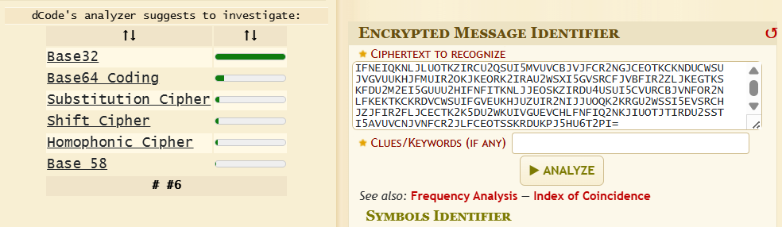
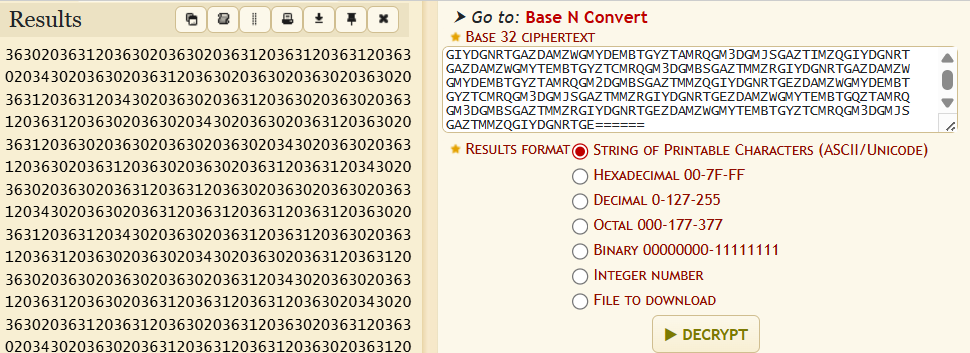
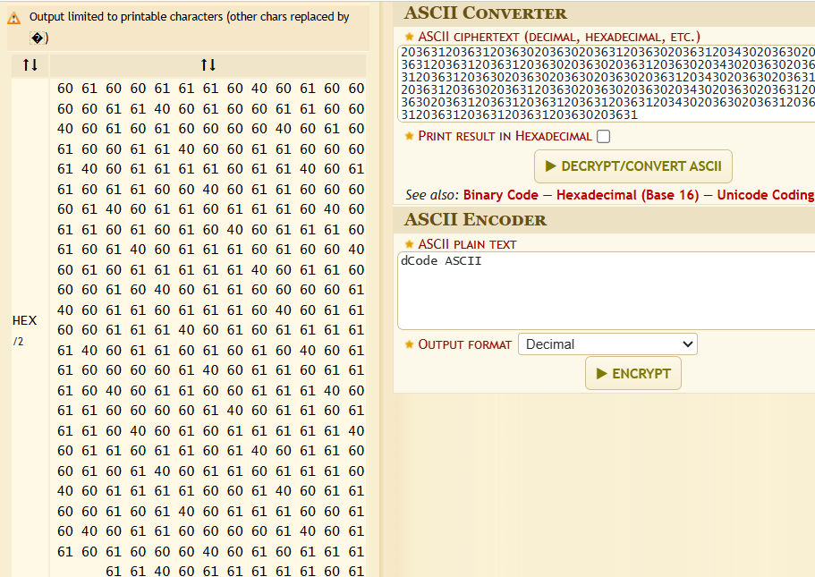
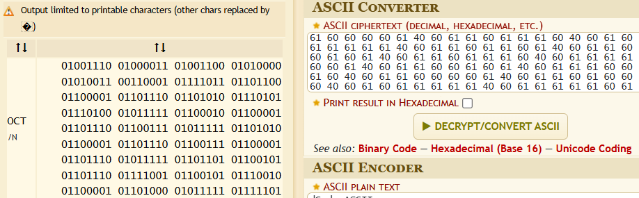
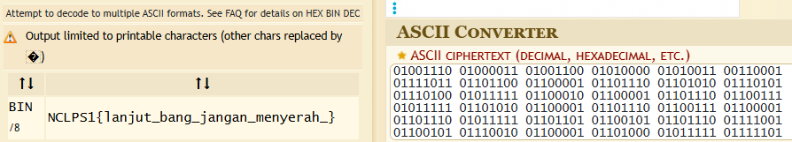

## klasik

**Difficulty:** Easy

**Author:** n4siKvn1ng

### Description

Kriptografi tidak selalu berisi terkait rumus, terkadang sebelum masuk ke rumus perlu untuk melakukan konversi terlebih dahulu ke bentuk yang lain.

### Solution

Diberikan ciphertext yang panjang. Dengan menggunakan [Cipher Identifier](https://www.dcode.fr/cipher-identifier) dapat diperoleh encodingnya adalah Base32.

Lakukan decode dua kali, karena output pertama menghasilkan encoding dari bas32 lagi. Hasil setelah di decode adalah bilangan hex.

Dengan menggunakan [ASCII Decode](https://www.dcode.fr/ascii-code) ditemukan hasil-nya adalah bilangan octal.

Di decode lagi dengan tools yang sama hasilnya adalah binary.

Di decode lagi dengan tools yang sama hasilnya adalah flag.

### Flag

NCLPS1{lanjut_bang_jangan_menyerah_}