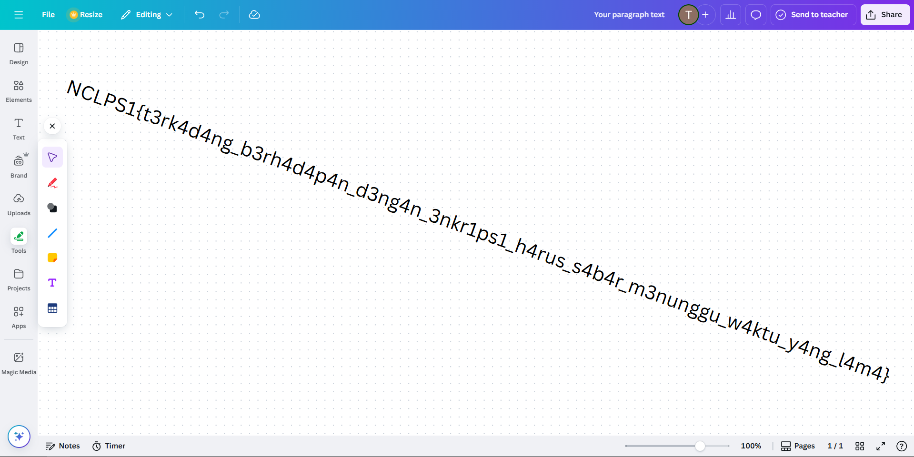

## thread
**Difficulty:** Hard
**Author:** n4siKvn1ng

### Description
Lagi ngerjain proyek yang kejar tayang tahun ini di bulan agustus dan pikiran cape lihat kodingan mulu, coba iseng untuk scroll fesnuk. Tiba-tiba disuguhkan oleh sebuah postingan terkait artikel "Decrypting Encrypted files from Akira Ransomware" dari website berikut:

https://tinyhack.com/2025/03/13/decrypting-encrypted-files-from-akira-ransomware-linux-esxi-variant-2024-using-a-bunch-of-gpus/#more-1090 Chall ini konsepnya meniru proses yang dilakukan di dalam artikel, tetapi versi mini. Artinya tidak perlu GPU cukup pakai CPU, jangan jalan sendiri tapi harus barengan dengan kerjaan berbeda.

### Solution
```python
import time
import random
from Crypto.Cipher import AES
from Crypto.Util.Padding import pad

INPUT_IMAGE = 'flag.png'
ENCRYPTED_OUTPUT = 'flag.png.enc'

def encrypt_file():
    with open(INPUT_IMAGE, 'rb') as f:
        plaintext = f.read()

    t1 = int(time.time()) // 10
    
    # print(f"Enkripsi diproses di sekitar timestamp: {t1}")
    random.seed(t1)

    key = random.randbytes(16)
    iv = random.randbytes(16)
    cipher = AES.new(key, AES.MODE_CBC, iv)
    
    encrypted_data = cipher.encrypt(pad(plaintext, AES.block_size))

    with open(ENCRYPTED_OUTPUT, 'wb') as f:
        f.write(encrypted_data)
        
    print(f"File '{INPUT_IMAGE}' berhasil dienkripsi menjadi '{ENCRYPTED_OUTPUT}'.")

if __name__ == "__main__":
    encrypt_file()
```

Pada source codenya diketahui bahwa program melakukan `random.seed(int(time.time()) // 10)` (seed dalam unit 10 detik). `key = random.randbytes(16)` dan `iv = random.randbytes(16)` dibuat dari modul `random` Python.Enkripsi menggunakan AES-CBC dengan padding PKCS#7 lalu Ciphertext disimpan tanpa IV. File plaintext yang dienkripsi adalah PNG (`flag.png`) sehingga dapat diketahui headernya `\x89PNG\r\n\x1a\n`.

Dengan diketahui hal - hal diatas, muncul strategi brute-force dengan mencoba semua seed waktu di suatu rentang, regen `key` dan `iv`, lalu verifikasi apakah dekripsi menghasilkan header PNG. Karena `random` di-seed dengan nilai waktu (rentang kecil relatif terhadap seluruh domain seed), pencarian cukup dapat diraih terutama bila kita memulai dari waktu pembuatan/mtime file. Tahapannya :
1. Ambil ciphertext (flag.png.enc) dan baca blok pertama (16 bytes) sebagai C0.
2. Ambil mtime file sebagai pusat (center = int(mtime) // 10) untuk jendela pencarian.
3. Untuk setiap kandidat seed t pada rentang (center ± R):
    * random.seed(t)
    * key = random.randbytes(16)
    * iv  = random.randbytes(16)
    * Hitung p0 = Dec_k(C0) XOR iv (gunakan AES-ECB untuk decrypt C0)
    * Jika p0 diawali dengan header PNG (b"\x89PNG\r\n\x1a\n"), kita temukan seed benar.
4. Setelah seed ditemukan, regen key/iv, decrypt seluruh CT dengan AES-CBC, unpad dengan PKCS#7, write file flag.png.

Untuk implementasinya adalah solver berikut ini:

```python
import os, time, random
from Crypto.Cipher import AES

enc_path = "flag.png.enc"
ct = open(enc_path, "rb").read()
c0 = ct[:16]
PNG = b"\x89PNG\r\n\x1a\n"

center_t1 = int(os.path.getmtime(enc_path)) // 10

def find_seed(center, radius_days=14):
    start = center - radius_days*8640
    end = center + radius_days*8640
    for t1 in range(start, end + 1):
        random.seed(t1)
        key = random.randbytes(16)
        iv  = random.randbytes(16)
        p0 = AES.new(key, AES.MODE_ECB).decrypt(c0)
        p0 = bytes(x ^ y for x, y in zip(p0, iv))
        if p0.startswith(PNG):
            return t1, key, iv
    return None, None, None

seed, key, iv = find_seed(center_t1, radius_days=120)
if seed is None:
    raise SystemExit("Seed tidak ditemukan")

from Crypto.Util.Padding import unpad
pt = AES.new(key, AES.MODE_CBC, iv).decrypt(ct)
pt = unpad(pt, 16)
open('flag.png', 'wb').write(pt)
print('Seed:', seed, 'UTC:', time.strftime('%Y-%m-%d %H:%M:%S', time.gmtime(seed*10)))
```

### Flag

