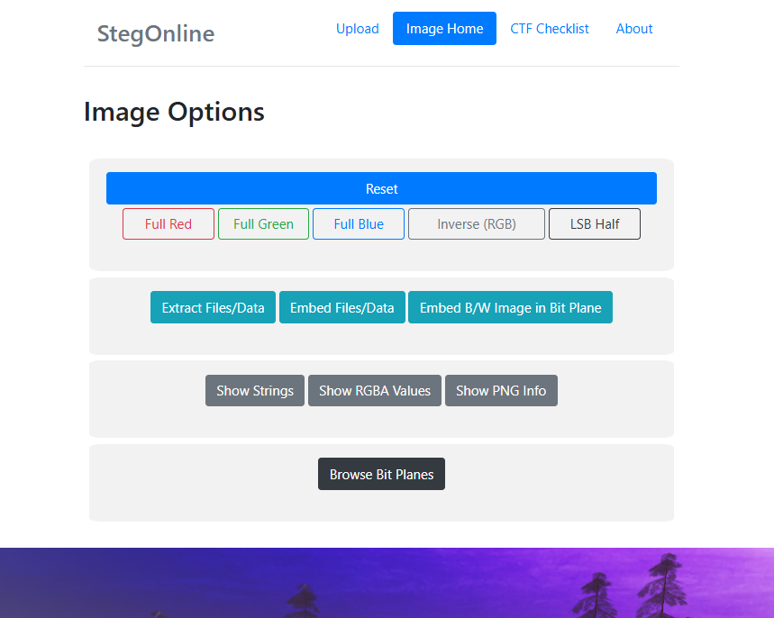
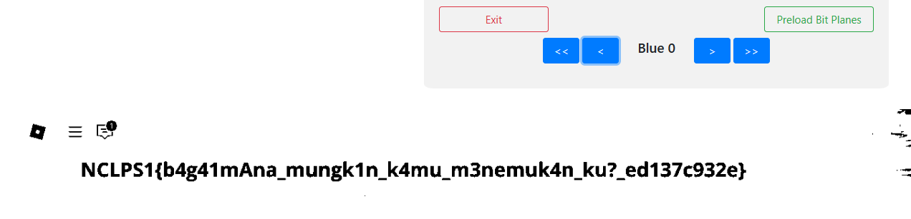

## a bit plan

### Description

### Solution

Dari judul chall mereferensikan ke teknik steganografi bit plane.

Dengan menggunakan tools dari (https://georgeom.net/StegOnline/upload) dapat ditelusuri bit planes-nya.

Flag ditemukan di Blue 0.

### Flag

NCLPS1{b4g41mAna_mungk1n_k4mu_m3nemuk4n_ku?_ ed137c932e}