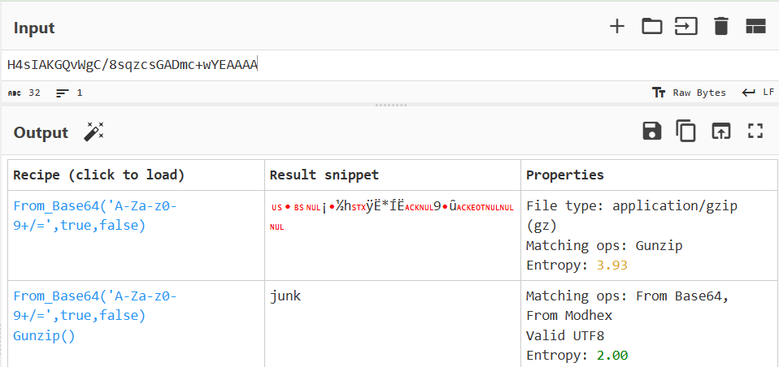
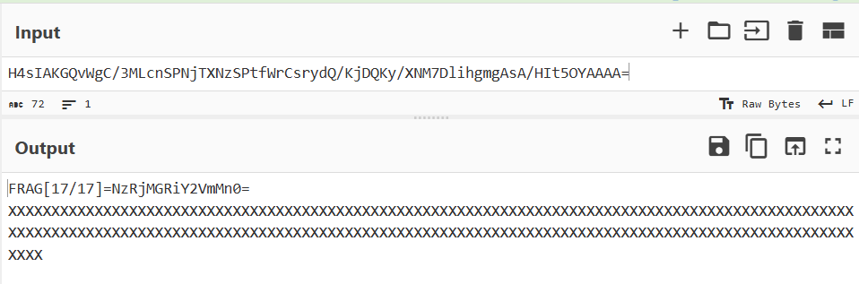
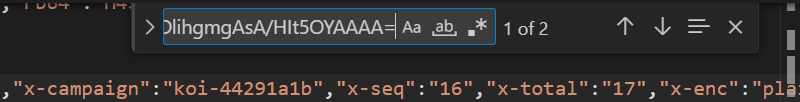

## Chunking

**Difficulty:** Medium
**Author:** moonetics

### Description

Pada 23–24 Agustus 2025 (WIB), tim security melihat lonjakan ke endpoint internal melewati reverse proxy produksi. Permintaan berasal dari beberapa ASN cloud dan residential. Tidak ada anomali mencolok di status HTTP (umumnya 200/204), tetapi metrik request length meningkat, sementara upstream response time tetap rendah. Dugaan awal adalah beaconing

### Solution

Saya mulai dengan mengekstrak file log yang diberikan. Langkah pertama adalah membuka log dan ditemukan field `rb64`. 

Dari field rb64, dilakukan pengambilan semua nilai rb64 dengan kode berikut:
```python
import sys, json, argparse

def iter_rb64(paths):
    for p in paths:
        try:
            with open(p, "r", encoding="utf-8", errors="ignore") as f:
                for line in f:
                    line = line.strip()
                    if not line:
                        continue
                    try:
                        o = json.loads(line)
                    except Exception:
                        continue
                    rb64 = o.get("rb64")
                    if rb64:
                        yield rb64
        except Exception as e:
            print(f"[!] Gagal membuka {p}: {e}", file=sys.stderr)

def main():
    path_1 = "23.log"
    path_2 = "23.1.log"
    path_3 = "24.log"
    count_in, count_out = 0, 0
    with open("rb64_all.txt", "w", encoding="utf-8") as out:
        for rb64 in iter_rb64([path_1, path_2, path_3]):
            count_in += 1
            out.write(rb64.rstrip() + "\n")
            count_out += 1

    print(f"Saved: rb64_all.txt")

if __name__ == "__main__":
    main()
```



Dari nilai rb64, saya mencari encoding yang digunakan dengan Magic dari CyberChef dan ditemukan kalo encodingnya adalah base64 lalu di-gunzip. Dari output beberapa rb64 yang telah di-decode hasilnya cuma `junk` dan beberapa decoy.



Dari analisa lebih lanjut pada nilai rb64, ditemukan panjang rb64 yang tidak biasa (`H4sIAKGQvWgC/3MLcnSPNjTXNzSPtfWrCsrydQ/KjDQKy/XNM7DlihgmgAsA/HIt5OYAAAA=`), Kalo hal tersebut di-decode hasilnya adalah suatu potongan fragment [17/17] dan potongan base64. 



Dari nilai yang ditemukan, apabila ditelusuri di log yang jadi pembeda adalah `x-campaign`-nya. Untuk nilai yang anomali ini nilainya adalah `x-campaign = koi-44291a1b`. Dengan begitu dapat dilakukan pengambilan  semua data rb64 pada `x-campaign = koi-44291a1b` lalu di decode. 

Saya melakukan otomasi terhadap langkah tersebut dengan solver berikut ini :

```python
import sys, json, argparse
import base64, zlib, re

def iter_rb64_for_campaign(paths, campaign):
    for p in paths:
        try:
            with open(p, "r", encoding="utf-8", errors="ignore") as f:
                for line in f:
                    line = line.strip()
                    if not line:
                        continue
                    try:
                        o = json.loads(line)
                    except Exception:
                        continue
                    hdr = o.get("hdr") or {}
                    if hdr.get("x-campaign") != campaign:
                        continue
                    rb64 = o.get("rb64")
                    if rb64:
                        yield rb64
        except Exception as e:
            print(f"[!] Gagal membuka {p}: {e}", file=sys.stderr)

def b64_gunzip_decode(data):
    try:
        decoded = base64.b64decode(data)
        decompressed = zlib.decompress(decoded, wbits=zlib.MAX_WBITS | 16)
        return decompressed.decode('utf-8', errors='ignore')
    except Exception as e:
        print(f"[!] Error decoding/decompressing data: {e}", file=sys.stderr)
        return None

def main():
    campaign = "koi-44291a1b"
    paths = ["23.log", "23.1.log", "24.log"]
    frags = {}
    patt = re.compile(r"FRAG\[(\d+)/\d+\]=([A-Za-z0-9+/=]+)")

    for rb64 in iter_rb64_for_campaign(paths, campaign):
        decoded = b64_gunzip_decode(rb64)
        if not decoded:
            continue
        for i, b64part in patt.findall(decoded):
            frags[int(i)] = b64part
    
    joined_b64 = ''.join(frags[i] for i in sorted(frags))
    try:
        print(base64.b64decode(joined_b64).decode('utf-8'))
    except Exception as e:
        print(f"[!] Gagal base64-decode gabungan: {e}", file=sys.stderr)

if __name__ == "__main__":
    main()
```

### Flag

NCLPS1{gz_m3rup4kAn_mUlt1m3mBer_bUk4n_P3r_cHunK_74c0dbcef2}