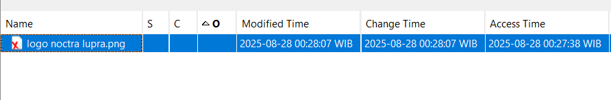
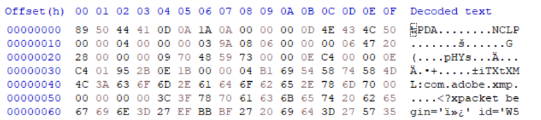
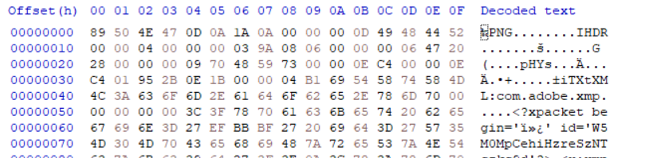
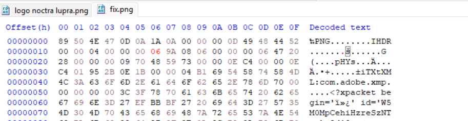
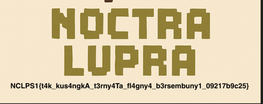

## Evaporated
**Difficulty:** Easy
**Author:** moonetics

### Description
someone is hide something there, but I don't know what they are hiding

### Solution


Diberi sebuah file evidence bernama `evaporated.001`. Saya membukanya di Autopsy untuk melihat isi artefaknya. Terlihat ada sebuah file terhapus bernama `logo noctra lupra.png`. Saya ekspor file tersebut untuk dianalisis lebih lanjut.



Saat dicoba dibuka, gambar tidak bisa ditampilkan. Dari sini saya beralih ke analisis heksadesimal untuk memeriksa signature-nya. PNG yang valid selalu diawali oleh 8 byte signature `89 50 4E 47 0D 0A 1A 0A`. Pada file ini, signature tersebut tidak sesuai sehingga corrupt. Saya perbaiki terlebih dahulu signature PNG‑nya dengan HxD.




Setelah signature dipulihkan, file sudah bisa dikenali sebagai PNG. Langkah berikutnya adalah mencari artefak tipikal stego. Saya cek metadata dan struktur umum terlebih dahulu:

```bash
exiftool logo.png
binwalk -eM logo.png
zsteg -a logo.png
strings -n 6 logo.png | less
```

Tidak ada hasil yang berarti dari EXIF, `binwalk`, `zsteg`, maupun `strings`. Dari sini saya berasumsi masalahnya bukan stego, melainkan kesalahan header PNG pada ukuran gambar.



Dalam format PNG, parameter lebar dan tinggi disimpan di chunk **IHDR** (13 byte data) tepat setelah signature. Jika nilai height dibuat terlalu kecil, baris piksel di bagian bawah akan tidak terlihat walaupun datanya sebenarnya masih ada di stream IDAT. Jadi, saya mengubah nilai **height** pada IHDR agar viewer merender baris tambahan tersebut.



Benar saja, setelah tinggi gambar diperpanjang, bagian bawah gambar yang sebelumnya tidak muncul sekarang ikut ter-render dan menampilkan tulisan flag. 

### Flag
NCLPS1{t4k_kus4ngkA_t3rny4Ta_fl4gny4_b3rsembuny1_09217b9c25}
