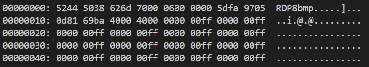
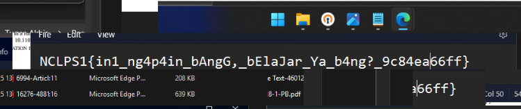

## Forgotten Fragments

**Difficulty:** Easy
**Author:** moonetics

### Description

Forgotten fragments of the screen still linger in the client’s memory.

### Solution

```bash
xxd -g 1 -l 64 Cache0000.bin
```

Langkah pertama, saya mengidentifikasi artefak yang diberikan. Dengan menggunakan hexdump, struktur awal byte terlihat cache RDP (Remote Desktop Protocol) yang menyimpan potongan layar (tiles) pada sisi klien Windows.



Dari sini, asumsi saya mengarah ke **RDP Bitmap Cache** yang biasanya tersimpan di direktori `C:\Users\<USER>\AppData\Local\Microsoft\Terminal Server Client\Cache\` dalam bentuk file `CacheXXXX.bin`. Karena ribuan tile akan sulit dibuka satu per satu, saya mengekstrak sekaligus menyusun menggunakan [bmc-tools](https://github.com/ANSSI-FR/bmc-tools).

```bash
python3 bmc-tools.py -s /home/byte/noctralupra/foren/forgotten_fragments/Cache0000.bin -b -d /home/byte/noctralupra/foren/forgotten_fragments/out
```

Langkah berikutnya, saya menyiapkan tool-nya dan menjalankan parsernya. Tool ini akan mengekstrak tile BMP serta—dengan opsi tertentu—membuat gambar kolase dari semua tile berdasarkan urutan di cache.



Dengan begitu, di folder out akan muncul banyak file `.bmp` hasil ekstraksi tile dan file kolase bernama **`_collage.bmp`**. Dari sini, saya membuka kolase tersebut dan memperbesar area teks yang paling jelas. Potongan-potongan antarmuka yang tadinya terpisah menjadi membentuk tampilan layar yang cukup terbaca, dan flag terlihat jelas di sana.

### Flag

NCLPS1{in1_ng4p4in_bAngG,_bElaJar_Ya_b4ng?_9c84ea66ff}
