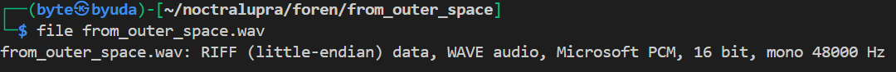
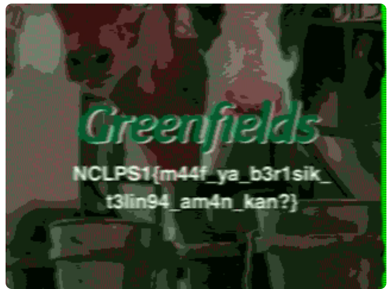

## From Outer Space

**Difficulty:** Easy
**Author:** moonetics

### Description

Sinyal misterius

### Solution

Pertama saya memeriksa file yang diberikan berupa audio `.wav`.

Karena ini sepertinya tantangan stegano audio, saya mencoba melakukan decode dengan [SSTV Decoder](https://sstv-decoder.mathieurenaud.fr/) dan berhasil mendapatkan gambar yang memunculkan flagnya.

### Flag

NCLPS1{m44f_ya_b3r1sik_t3lin94_am4n_kan?}
