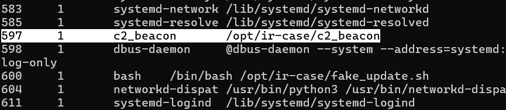
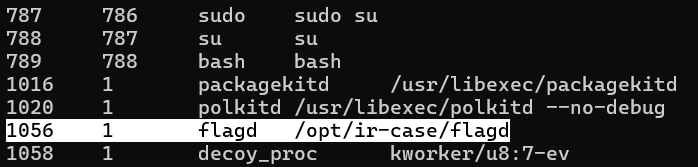
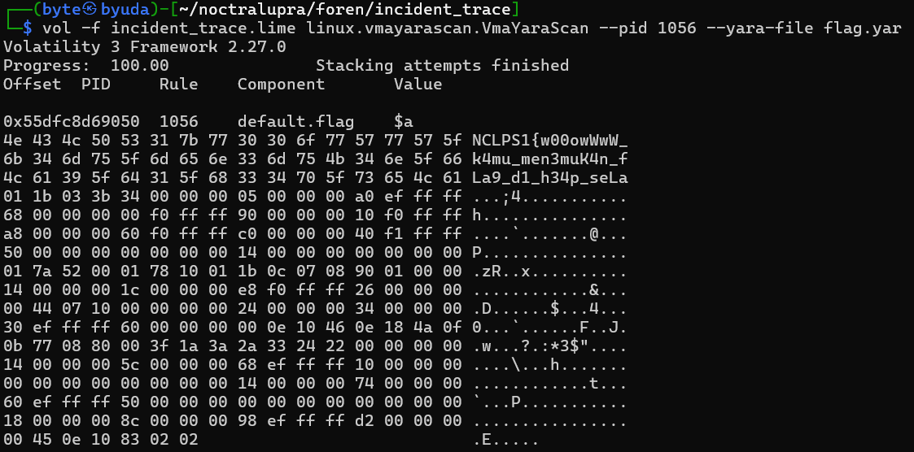
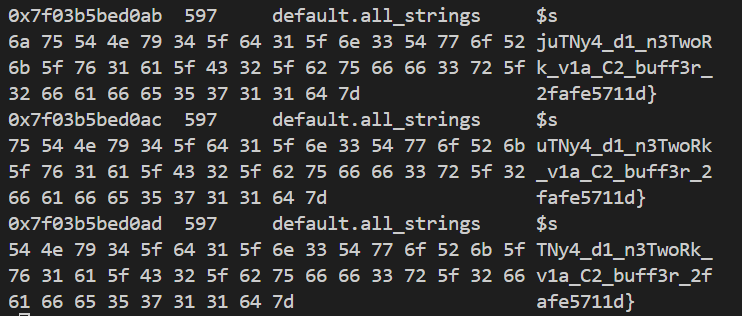

## Incident Trace

**Difficulty:** Medium
**Author:** moonetics

### Description

Sebuah mesin memperlihatkan aktivitas tak biasa, diduga terinfeksi binary berbahaya. Timmu berhasil memperoleh memory dump dari mesin tersebut. Periksa lebih dalam untuk menemukan artefak penting yang tersembunyi ataupun mencurigakan.

[Download](https://drive.google.com/file/d/1SP2rBKwu5wlDpr81rc7Ngvr5ii87dH6G/view)

Note: Flag has 2 parts

### Solution

Saya mulai dengan asumsi bahwa file yang diberikan berformat `*.lime` (Linux memory extractor). Dalam kasus ini saya menggunakan Volatility untuk mengekstrak proses dan area memori yang relevan. 




Dengan command diatas, dapat dump proses dari memory tersebut. Disini ditemukan proses flagd dan c2_beacon, beserta pid-nya yaitu 1056 (flagd) dan 597 (c2_beacon).

```yara
rule flag {
  strings:
    $a = /NCLPS1\{[^\}]{0,256}/ ascii wide
  condition:
    $a
}
```

Sebelum melakukan dump dari isi proses - proses tersebut, saya membuat yara rule yang nantinya digunakan untuk scanning flag. Dengan yara rule tersebut, akan dicari pola flag apa pun yang berbentuk NCLPS1{... dengan dukungan UTF-16LE lewat wide, dan match terjadi kalau ada kemunculan pola tersebut.

```bash
vol -f incident_trace.lime linux.vmayarascan.VmaYaraScan --pid "1056" --yara-file flag.yar
vol -f incident_trace.lime linux.vmayarascan.VmaYaraScan --pid "597" --yara-file flag.yar
```

Berikutnya adalah menggunakan plugin linux.vmayarascan.VmaYaraScan untuk melakukan dump isi dari proses sesuai dengan PID-nya dengan aturan scanning dari flag.yar.



Dari hasil scanning ditemukan partA ada di PID 1056, tetapi pada PID 597 tidak menghasilkan apa - apa.

```yara
rule all_strings {
  strings:
    $s = /[ -~]{6,}/ ascii wide
  condition:
    $s
}
```
```bash
vol -f incident_trace.lime linux.vmayarascan.VmaYaraScan --pid "597" --yara-file flag.yar
```

Dengan begitu saya men-dump semua strings yang ada pada PID 597 dengan yara rule diatas.



Saya menyimpan hasil scanning tersebut ke dalam file c2.txt dan flag partB ditemukan pada response body dari c2-nya.

### Flag

NCLPS1{w00owWwW_k4mu_men3muK4n_fLa9_d1_h34p_seLanjuTNy4_d1_n3TwoRk_vla_C2_buff3r_2fafe5711d}