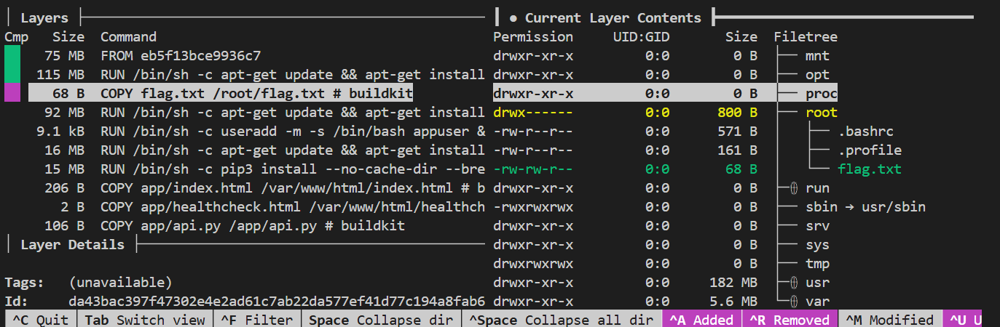
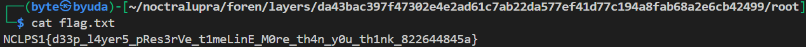

## Layers

**Difficulty:** Easy-Medium
**Author:** moonetics

### Description

Sebuah layanan internal (web static di reverse Nginx dengan backend di /api) sempat dibuild dan didistribusikan. Setelah itu, salah satu developer mengakui pernah memasukkan sebuah berkas teks berisi token internal ke dalam layanan tersebut, lalu diubah isinya beberapa waktu kemudian, dan akhirnya dihapus pada build berikutnya. Untuk keperluan audit & rotasi kredensial, tim diminta memastikan apakah artefak token itu masih tersisa, dan bila masih ada mengambil nilai token tersebut.

[Download](https://drive.google.com/file/d/1oeYj7H-e4n-fQV3r47OpkoICb0H7ulwl/view)

### Solution

Diberikan file `layers.tar` yang ternyata berformat OCI image layout. Langkah pertama adalah mengonversi OCI-layout ke bentuk yang lebih mudah dianalisis (docker-archive). Untuk itu saya menggunakan `skopeo`. Perintah konversinya seperti berikut:

```bash
skopeo copy oci-archive:layers.tar docker-archive:layers-docker.tar:nclp/layers:latest
```

`skopeo copy` membantu menngubah OCI layout menjadi docker-archive yang didukung oleh tools seperti `dive` dan juga mempermudah inspeksi metadata image (manifest/config) tanpa harus menjalankan container. Dari sini saya membuka hasil `docker-archive` menggunakan `dive` untuk melihat daftar layer, command history (instruksi `RUN`, `COPY`, dsb.) dan isi layer secara interaktif:

```bash
dive docker-archive://layers-docker.tar
```



Dengan `dive` saya mengamati layer yang berisi instruksi yang mencurigakan, terdapat sebuah perintah `COPY flag.txt /root/flag.txt`. Dari hasil inspeksi `dive` saya bisa mendapatkan ID layer `da43bac397f47302e4e2ad61c7ab22da577ef41d77c194a8fab68a2e6cb42499` dari command tersebut. Untuk langkahnya seperti berikut

1. Extract tar file dengan command:

```bash
tar xvf layers-docker.tar
```
2. Karena outputnya masih menghasilkan ID layer yang ditemukan tadi berbentuk tar, extract itu lagi.
3. Baca file flag.txt



### Flag

NCLPS1{d33p_l4yer5_pRes3rVe_t1meLinE_M0re_th4n_y0u_th1nk_822644845a}

### Referensi

https://05t3.github.io/posts/Urchinsec-CTF/