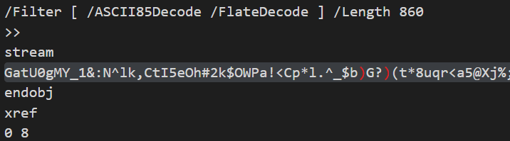

## Redaction Fail
**Difficulty:** Easy
**Author:** moonetics

### Description
Divisi compliance menyerahkan sebuah dokumen final yang telah dirilis ke pihak eksternal. Dokumen tersebut memuat blok hitam menutupi sebuah informasi sensitif. Ada dugaan bahwa proses “redaksi” tidak dilakukan dengan benar.

### Solution
Saya mulai dengan membuka PDF dan melihat bagian yang disensor. Tapi sepertinya, ini hanyalah decoy saja dan tidak berpengaruh ke pencarian flagnya.

Langkah berikutnya adalah memeriksa struktur internal PDF. Saya melaakukan command string pada file untuk mencari petunjuk filter kompresi dan pola yang tidak biasa.



Dari sini, saya melihat ke suatu objek (objek ke‑7) dengan properti filter `ASCII85Decode` dan `FlateDecode`, serta terlihat string yang aneh. Ini indikasi kuat bahwa ada data yang terlebih dulu di‑ASCII85, kemudian dikompresi zlib/deflate. Dengan begitu, target saya adalah mengekstrak stream objek tersebut dan melakukan dua tahap decoding. Saya melakukannya dengan kode berikut:

```python
import base64
import zlib

data = r'''GatU0gMY_1&:N^lk,CtI5eOh#2k$OWPa!<Cp*l.^_$b)G?)(t*8uqr<a5@Xj%;hgHamt.,R56YB^nDk)?De.g4bp?S%%%EM#0cQ3^i/.oGC#)No8\RHL"MH4ELau*#7S6VN.BSQa.^gT@"/OoHZ9.bpT2c!#p0@54BHJYi\7H7W%Anj/ok55j]ii/IfOrG?sbb_N71SrSASPpJ?'j.*"N9502OZ5.ec`5\i@01DHNpeoP:J0laXd!P;mR6@D>`)J_fB)R\QJ#Z06fR_aH&X;"qgl:%U2,Xj5Q?IpLu)c=B[Ont<*=)@PcG(`2fO>9jpTA()C;gCYh>>]9XE^uR@E&jm@'m/S^*V+3iY,P)YEL+bl+V)_XK'X@ZF+pqL>Ib)s@iEB4!6dkGE#i0$%j"T>*c,5?B05CHje8pM2335EZ_L*Y<]e'AQ7[?MI>X:iO+#&&;JsYO42`-r6G?Du[g.Ig@'\7/g=<Lki[3Um'P=l(3.[0R-TRS,->"uN$rZD&NR'_HWGK3Ef?pe'_-<J&b&!_f?gFB+Ib`mKXEq>aJ_PkufQag`OA3C3@3C`'r;k?encni(oVA1\Mh0>O.!qca:AbjZ8_]X65GVF"\BQ+qMEL?(f5o9WoBp_FA@A'id#^8eVo:+-\ICE[e2nm7Q<qu8CA#]"LCa'mjIe1Qj.Ygs_I1huYO]J5.6S;9uBst*@<MQ'8o2spq_Y\=sI+Y@SlM!;M8SRnWU<G,61t=%kapdm=mS)KtS5r`Z/mq7LQpX`El+QJ7,?Ze1<W#r;73UimjCsO*4WOOHX`rZ>mU![%N:$BF7`*5C;$u3*E[K`tP(aT+\GRhRQ'H+c\$MKmMY9UBSY&f5[0Z~>'''

decoded_a85 = base64.a85decode(data, adobe=True)

try:
    result = zlib.decompress(decoded_a85)
except zlib.error:
    result = zlib.decompress(decoded_a85, -15)

print(result.decode("utf-8", errors="replace"))
```

### Flag
NCLPS1{teRny4ta_fl4g_d1_r3v1Si0n_z3Ro_iNcr3MenTal_uPddaTe_m3n1pu_m4ta_0dd31503e3}
