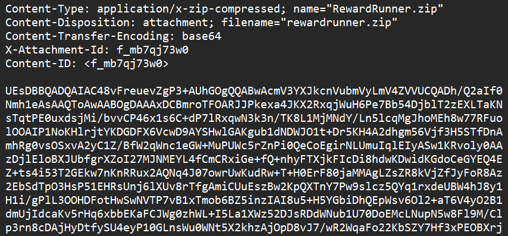
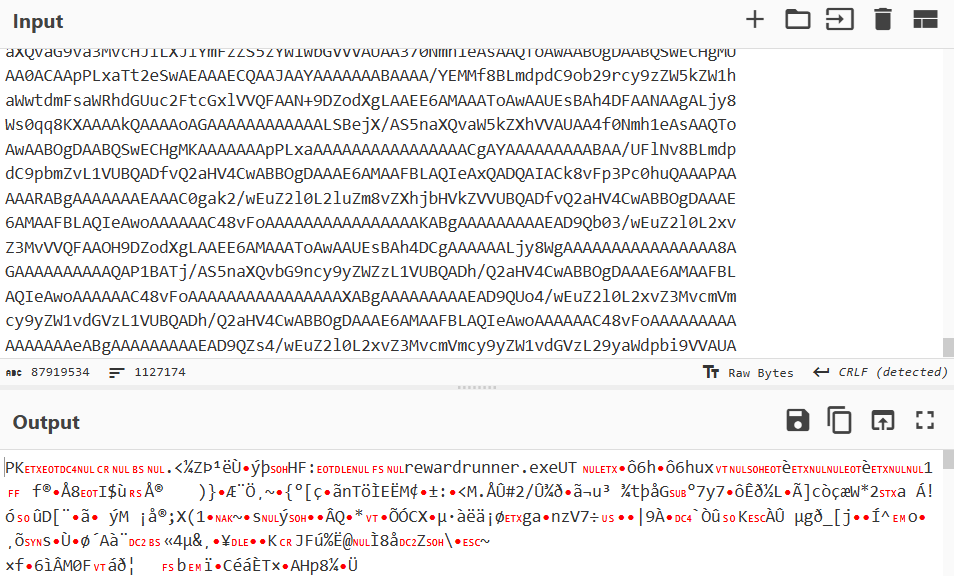
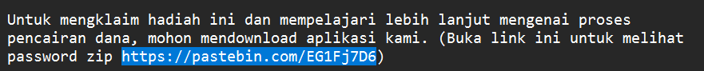
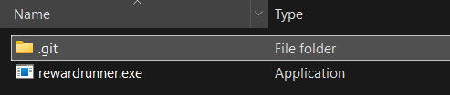
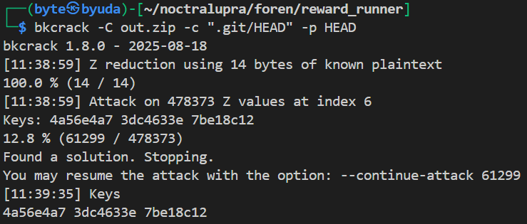
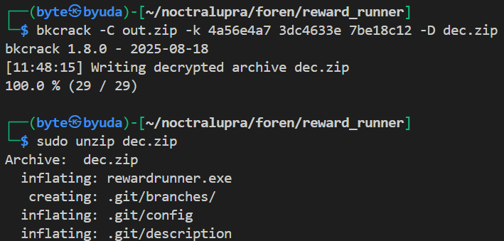
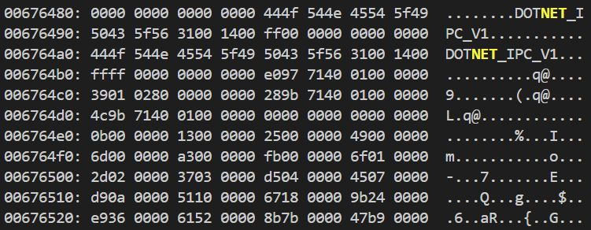
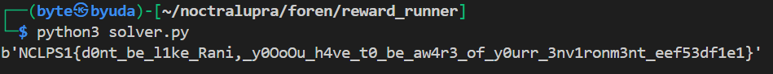

## Reward Runner

**Difficulty:** Medium
**Author:** moonetics

### Description

Rani baru saja mendapatkan email aneh. Pada email tersebut Rani diberikan file "rewardrunner.exe". Saat dijalankan Rani kehilangan pesan penting-nya. Tolong Rani membalikkan pesan penting tersebut.

### Solution




Pertama-tama saya membuka email dan memeriksa isi pesan. Pada email terdapat sebuah string base64, setelah di-decode base64 tersebut ternyata hasilnya adalah sebuah berkas arsip ZIP. 



Dari sini saya mencoba mengekstrak ZIP tersebut, namun arsip meminta kata sandi. Dari email ada sebuah tautan Pastebin yang mengarahkan ke sebuah referensi teknik *known plaintext attack* terhadap file ZIP yang terenkripsi. 



Langkah berikutnya saya melihat isi arsip ZIP tanpa mengekstraknya secara penuh dan menemukan bahwa di dalam arsip tersebut ada folder `.git` beserta file `HEAD` di dalamnya, ini menjadi sumber plaintext yang diketahui (known plaintext) yang akan kita gunakan untuk menyerang enkripsi ZIP.

```bash
bkcrack -C out.zip -c ".git/HEAD" -p HEAD
```

Dari sini saya menggunakan `bkcrack` yang memang ditujukan untuk melakukan known-plaintext attack terhadap ZIP. Perintah di atas memberi tahu `bkcrack` untuk mengambil ciphertext dari `rewardrunner.zip` dan menunjukkan file ciphertext yang sesuai (`.git/HEAD`) serta memberikan plaintext yang diketahui (`HEAD`) sebagai input untuk key stream dan memulihkan key ZIP. 



Dengan begitu `bkcrack` dapat menghitung kunci enkripsi untuk seluruh arsip dan kita bisa mengekstrak file di dalamnya.



Langkah berikutnya, setelah memperoleh kunci dari `bkcrack`, saya mengekstrak isi arsip ZIP menggunakan kunci tersebut. Di antara file yang diekstrak ada `rewardrunner.exe`. 



Dari analisis awal terhadap `rewardrunner.exe` terlihat bahwa ini adalah program yang dikompilasi menggunakan .NET. Untuk itu saya menggunakan decompiler yang familiar dengan .NET, misalnya [ILSpy](https://github.com/icsharpcode/ILSpy) untuk men-decompile binary dan melihat fungsi `Main` serta logika enkripsi dekripsi yang dipakai program.

```csharp
// rewardrunner, Version=1.0.0.0, Culture=neutral, PublicKeyToken=null
// RewardRunner.Program
using System;
using System.IO;
using System.Security.Cryptography;
using System.Text;

internal class Program
{
	private static readonly byte[] AesKey = Encoding.UTF8.GetBytes("id-networkersnlc");

	private static readonly byte[] XorKey = Encoding.UTF8.GetBytes("notcra_lupra");

	private static byte[] xorstep(byte[] data, byte[] xorKey)
	{
		byte[] array = new byte[data.Length];
		for (int i = 0; i < data.Length; i++)
		{
			array[i] = (byte)(data[i] ^ xorKey[i % xorKey.Length]);
		}
		return array;
	}

	private static void Main(string[] args)
	{
		string currentDirectory = Directory.GetCurrentDirectory();
		string[] files = Directory.GetFiles(currentDirectory);
		string[] array = new string[5] { ".exe", ".dll", ".pdb", ".idn.enc", "LICENSE" };
		Console.WriteLine("Encrypting files in: " + currentDirectory);
		string[] array2 = files;
		foreach (string text in array2)
		{
			string fileName = Path.GetFileName(text);
			bool flag = false;
			string[] array3 = array;
			foreach (string value in array3)
			{
				if (fileName.EndsWith(value, StringComparison.OrdinalIgnoreCase))
				{
					flag = true;
					break;
				}
			}
			if (flag)
			{
				Console.WriteLine("Skipping: " + fileName);
				continue;
			}
			try
			{
				byte[] data = File.ReadAllBytes(text);
				Console.WriteLine("Encrypting: " + fileName);
				byte[] array4 = xorstep(data, XorKey);
				using (Aes aes = Aes.Create())
				{
					aes.Key = AesKey;
					aes.Mode = CipherMode.CBC;
					aes.Padding = PaddingMode.PKCS7;
					aes.GenerateIV();
					byte[] iV = aes.IV;
					using ICryptoTransform cryptoTransform = aes.CreateEncryptor(aes.Key, aes.IV);
					byte[] array5 = cryptoTransform.TransformFinalBlock(array4, 0, array4.Length);
					byte[] array6 = new byte[iV.Length + array5.Length];
					Buffer.BlockCopy(iV, 0, array6, 0, iV.Length);
					Buffer.BlockCopy(array5, 0, array6, iV.Length, array5.Length);
					File.WriteAllBytes(text + ".idn.enc", array6);
				}
				File.Delete(text);
			}
			catch (Exception ex)
			{
				Console.WriteLine("Error encrypting " + fileName + ": " + ex.Message);
			}
		}
		Console.WriteLine("Encryption complete.");
	}
}
```

Hasil dekompilasi pada metode Main menunjukkan algoritma yang jelas, file  pertama-tama di-XOR menggunakan sebuah kunci `notcra_lupra`, lalu dienkripsi dengan AES-CBC menggunakan kunci AES `id-networkersnlc`. Urutannya saat enkripsi adalah: plaintext → XOR dengan XorKey → AES-CBC encrypt dengan AesKey dan random IV. 

Untuk dekripsi kita harus membalik langkah ini: baca IV, AES-CBC decrypt, hapus padding PKCS#7, lalu lakukan XOR ulang dengan XorKey untuk mendapatkan plaintext asli. Dari sini saya menulis logika dekripsi itu dalam seperti berikut:

```python
from Crypto.Cipher import AES

key = b"id-networkersnlc"
xor_key = b"notcra_lupra"

data = open("secret.txt.idn.enc","rb").read()
iv, ct = data[:16], data[16:]

# AES-CBC decrypt
pt_xored = AES.new(key, AES.MODE_CBC, iv=iv).decrypt(ct)

# PKCS7 unpad
pad = pt_xored[-1]
pt_xored = pt_xored[:-pad]

# reverse XOR
pt = bytes(b ^ xor_key[i % len(xor_key)] for i, b in enumerate(pt_xored))

print(pt)
```

Dengan menjalankan script tersebut pada `secret.txt.idn.enc` yang diekstrak dari arsip, file `secret.txt` berhasil dibuat berisi pesan penting (flag). Dengan begitu didapatkan flagnya.



### Flag

NCLPS1{d0nt_be_l1ke_Rani,_y0OoOu_h4ve_t0_be_aw4r3_of_y0urr_3nv1ronm3nt_eef53df1e1}