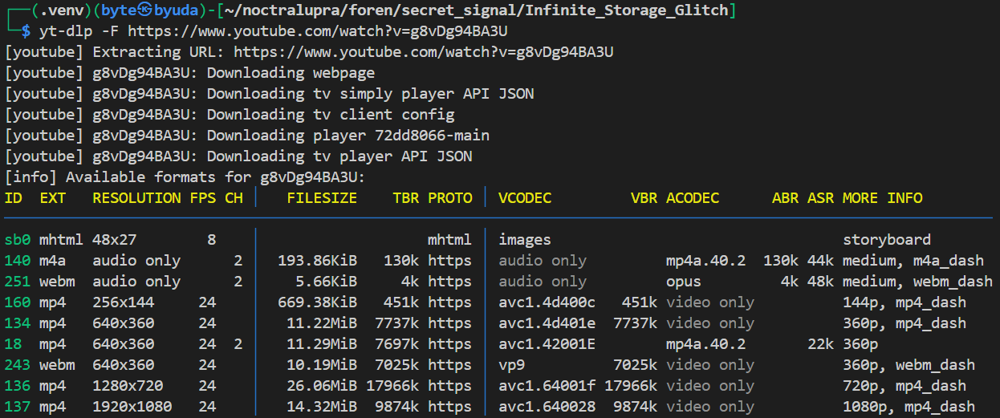
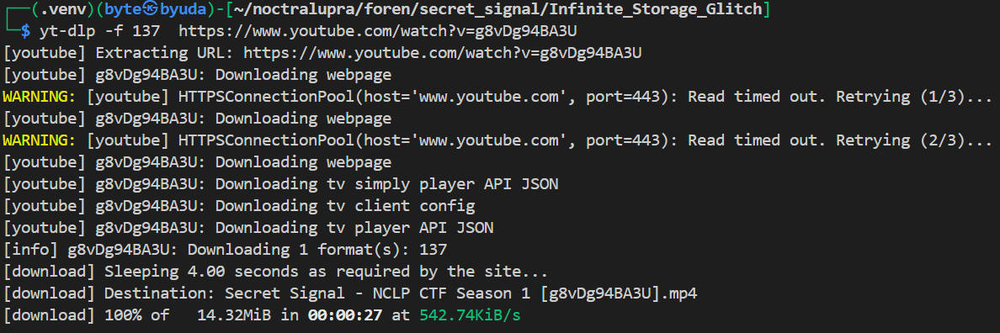
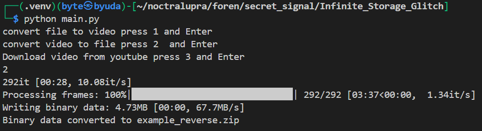
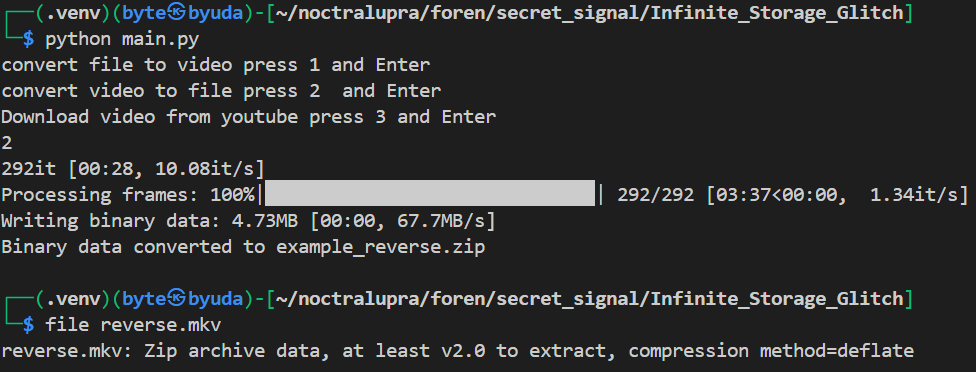

## Secret Signal
**Difficulty:** Easy-Medium
**Author:** moonetics

### Description
Fenomena aneh terjadi: sebuah media penyimpanan yang tampaknya memiliki kapasitas tak terbatas. Namun, keajaiban ini hanyalah ilusi—ada sesuatu yang tersembunyi di balik ‘glitch’ tersebut. Setiap lapisan data seakan menutupi lapisan berikutnya, membuat isi sebenarnya sulit dikenali. Petunjuknya ada pada struktur file yang tidak biasa, seakan ada celah di antara byte yang bisa dimanfaatkan. Bisakah kamu menemukan rahasia yang tersembunyi di balik anomali penyimpanan tak berujung ini?
URL: https://www.youtube.com/watch?v=g8vDg94BA3U

### Solution
Dari deskripsi soal, terlihat jelas referensi ke teknik **Infinite Storage Glitch (ISG)** yang memang memanfaatkan file media (terutama video) sebagai tempat data tersembunyi. 

```bash
yt-dlp -F https://www.youtube.com/watch?v=g8vDg94BA3U
```


Hal pertama yang saya lakukan adalah mengecek format resolusi video YouTube tersebut menggunakan `yt-dlp` dengan perintah di atas.


```bash
yt-dlp -f 137 https://www.youtube.com/watch?v=g8vDg94BA3U
```


Dari hasil listing format, ditemukan bahwa video dengan resolusi **1080p** tersedia pada format ID `137`. Maka saya unduh video tersebut dengan perintah di atas.



Setelah file video berhasil diunduh, langkah berikutnya adalah melakukan ekstraksi menggunakan ISG yang tersedia di GitHub: [Infinite\_Storage\_Glitch](https://github.com/KKarmugil/Infinite_Storage_Glitch).

```bash
file output.mkv
```


Hasil ekstraksi berupa file `reverse.mkv`. Saat saya cek dengan perintah `file`, ternyata formatnya bukan MKV sungguhan, melainkan **ZIP archive** yang disamarkan.

```bash
mv output.mkv secret.zip
unzip secret.zip
```

Untuk itu saya ganti ekstensi filenya menjadi `.zip`


Di dalam hasil ekstraksi ditemukan image berisi flag.

### Flag
NCLPS1{k1ta_bisA_menyimPAn_fiLe_t4npa_b4tas_d1_yOutub3_f9c3d7cd98}
