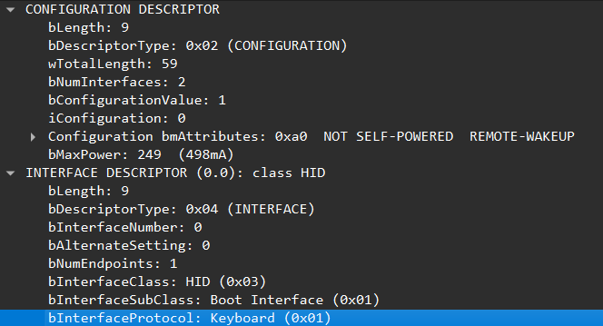
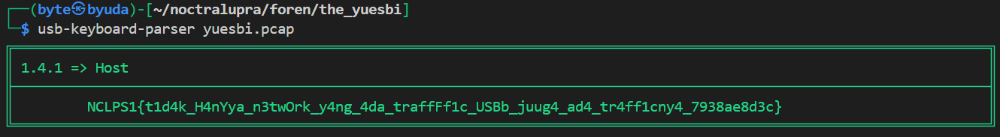

## the yuesbi

**Difficulty:** Easy
**Author:** moonetics

### Description

harusnya kamu sudah tau ini apa? menarik bukan?

### Solution

Saya mulai dengan membuka berkas `yuesbi.pcap` di Wireshark. Saat menelusuri paket, tampak proses enumerasi perangkat USB (GET_DESCRIPTOR, SET_CONFIGURATION) yang mengindikasikan ada **HID Keyboard**. 

Saya menggunakan tools usb-keyboard-parser dari (https://usb.org/sites/default/files/hut1_5.pdf) dengan perintah diatas. Tools ini langsung mendeteksi packet yang di-capture dari perangkat keyboard melalui HID data dan melakukan decode secara otomatis. Outputnya langsung memunculkan flagnya.

### Flag

NCLPS1{t1d4k_H4nYya_n3twOrk_y4ng_4da_traffFf1c_USBb_juug4_ad4_tr4ff1cny4_7938ae8d3c}