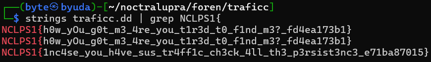

## traficc

**Difficulty:** Medium
**Author:** moonetics

### Description

Aku baru saja kehilangan pesan penting ku. Tampaknya ada sesuatu yang aneh pada jaringan ku. Bantu aku mencarinyaa.

[Download](https://drive.google.com/file/d/12hzLe5QYMmsBdPBF5ogQztgpTSFwxGNe/view)

### Solution

Diberikan dua file untuk tantangan ini, file pcapng dan dd. Untuk analisis awal, saya melakukan command strings pada kedua file dan pipe dengan command grep `NCLPS1{` untuk mendapatkan flagnya. (i know it's kinda unintended but that's how you recon all artifacts that are given by the chall hehe).

### Flag

NCLPS1{h0w_yOu_g0t_m3_4re_you_t1r3d_t0_f1nd_m3?_fd4ea173b1}