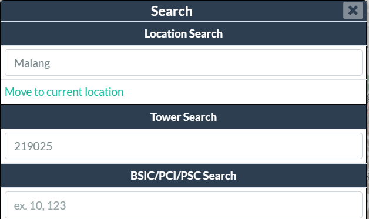
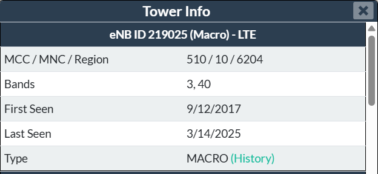
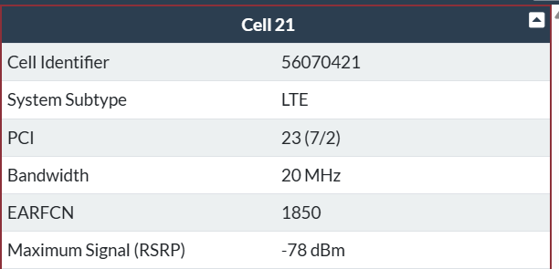
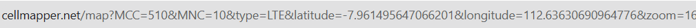
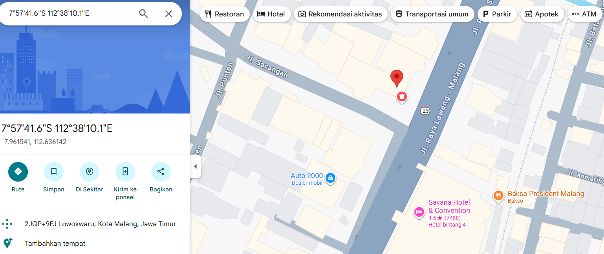
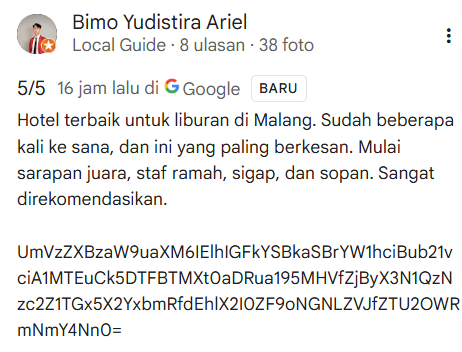
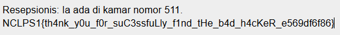

## Finding Ghostline
**Difficulty:** Medium
**Author:** moonetics

### Description
Profil bad hacker "Ghostline" kembali muncul. Telemetri baseband cell tower menunjukkan lock ke Telkomsel dengan eNB ID 219025; B3 1800 sebagai anchor dan B40 2300 sebagai kapasitas. Intel lapangan mempersempit pergerakan Ghostline ke kawasan Klojen, Kota Malang (Jawa Timur - Indonesia). Pelaku diduga berada di dekat sebuah hotel. Sayangnya, catatan peta BTS internal kami sudah dipurge. Bisa bantu kamu mencari "Ghostline" dari informasi yang kami berikan?

Question 1
Apa MCC / MNC / Region dari eNB ID tersebut?

Question 2
Berapa Maximum Signal (RSRP) tertinggi dari salah satu Cell?. Answer format: XX dBM or -XX dBm

Question 3
Dimana latitude dan longitude cell tower tersebut? Maximum 1 number decimal. Answer format example: -444.4:22.2

Question 4
Temukan hotel terdekat di area tersebut yang kemungkinan menjadi posisi Ghostline?. Answer format: Name Hotel

Question 5
Temukan pesan rahasia di hotel tersebut. Answer format: NCLPS1{.*}

### Solution
Karena ini chall pertama saya buat ngedoksing dari enb id, saya coba surfing dikit di internet dan ketemu threads https://www.ispreview.co.uk/talk/threads/how-to-see-which-cell-tower-i-have-connected-to.39090/ yang enb id bisa digunakan untuk mencari cell tower yang digunakan oleh user lewat web cellmapper.net.

Pada tab search masukkan enb id dan kota malang sesuai dengan info yang didapat dari deskripsi

Soal 1 jawabannya 510 / 10 / 6204

Soal 2 jawabannya -78 dBm

Soal 3 jawabannya ada di url 

Soal 4 masukin latitude dan longitude ke gmaps trus ada hotel yang berseberangan dengan lokasi tower

Soal 5, masuk ke review hotel -> filter ke terbaru ada -> ada review yang nyantumin format base64 -> decode hal ini untuk mendapatkan flagnya.

### Flag
NCLPS1{th4nk_y0u_f0r_suC3ssfuLly_f1nd_tHe_b4d_h4cKeR_e569df6f86}
