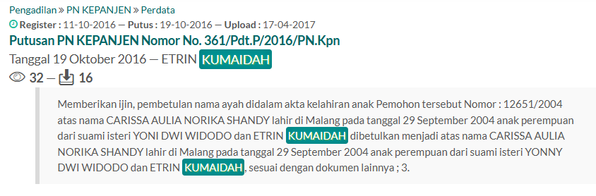
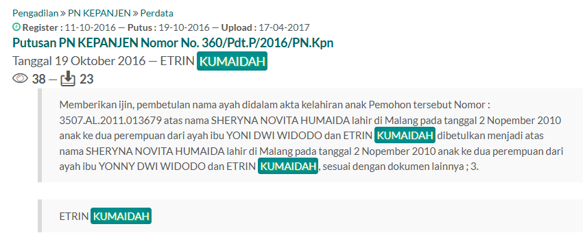
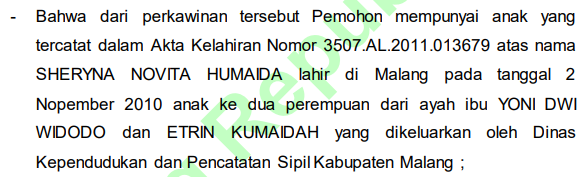
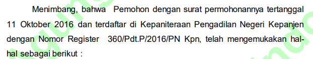
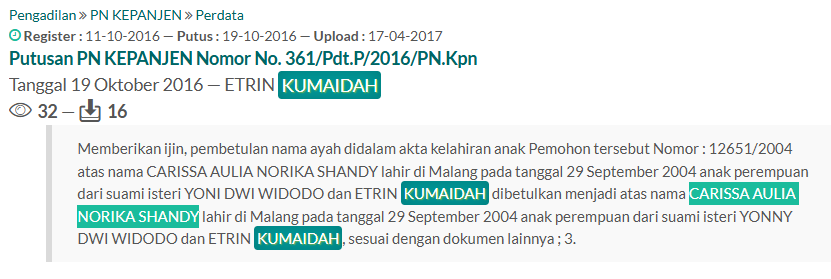
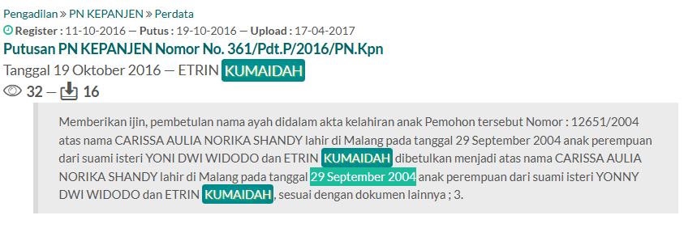
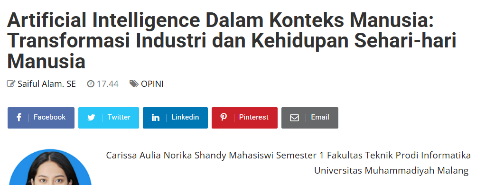
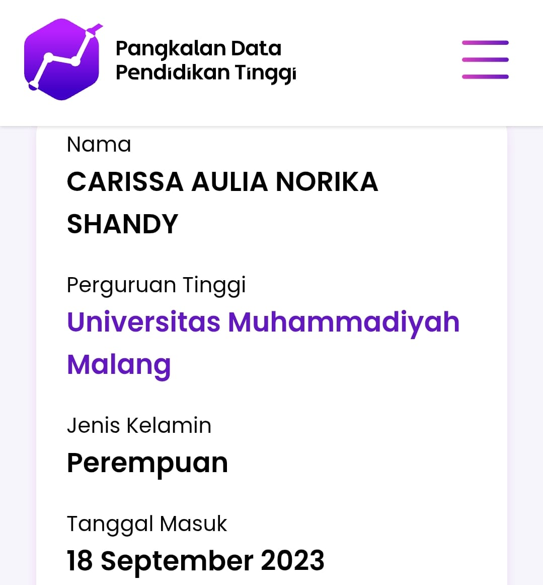

## halo
**Difficulty:** Easy-Medium
**Author:** xxx

### Description
Halo, namaku Yonny Dwi Widodo. Aku mempunyai 2 anak dan 1 orang istri yang sangat cantik.

Note: This challenge is for educational purposes only. Do not misuse any information you find.

Question 1
Apa nama yang dipakai Yonny sebelum "Yonny Dwi Widodo"?. Answer format: UPPERCASE

Question 2
Siapa nama pasangan (istri) Yonny?. Answer format: UPPERCASE

Question 3
Di kecamatan apa Yonny tinggal?. Answer format: UPPERCASE

Question 4
Siapa nama anak pertama Yonny?. Answer format: UPPERCASE

Question 5
Kapan tanggal lahir anak pertama Yonny?. Answer format example: 11 Januari 1980

Question 6
Anak pertama Yonny pernah membuat artikel tentang AI. Apa judul artikel tersebut?

Question 7
Dimana anak pertama Yonny berkuliah?. Answer format example: Universitas Gadjah Mada

Question 8
Sebutkan tanggal mulai kuliah anak pertama Yonny. Answer format: 11 Januari 1980

### Solution

Dengan melakukan google dorking didapatkan dua archive putusan MA dari Yonny Dwi Widodo.

Jawaban soal 1 adalah `YONI DWI WIDODO`.

Jawaban soal 2 adalah `ETRIN KUMAIDAH`.

Jawaban soal 3 adalah tempat dimana persidangan dilakukan yaitu `KEPANJEN`.

Nama anak pertamanya adalah `CARISSA AULIA NORIKA SHANDY` (soal 4).

Lahir tanggal `29 September 2004` (soal 5).

Dengan memasukkan keyword nama anak pertama pada Google maka dapat diketahu bahwa dia pernah menulis artikel dengan judul `Artificial Intelligence Dalam Konteks Manusia: Transformasi Industri dan Kehidupan Sehari-hari Manusia` (soal 6).

Dengan mencari data anak pertamanya di pddikti dapat diketahu bahwa dia berkuliah di `Universitas Muhammadiyah Malang` (soal 7) dan tanggal masuknya adalah `18 September 2023` (soal 8).
