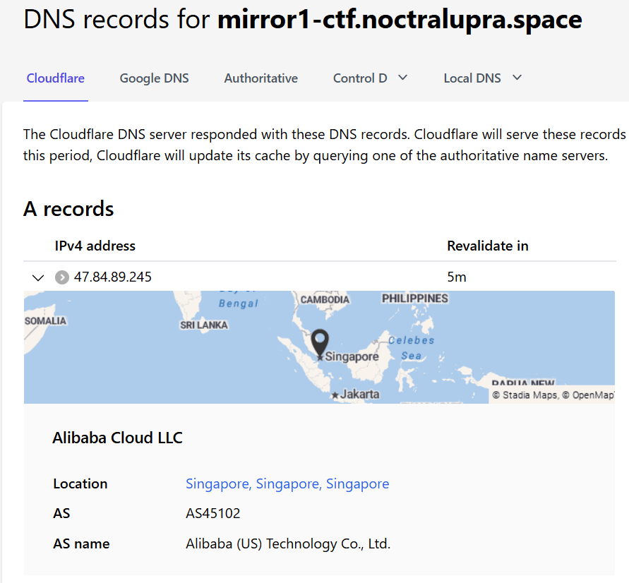
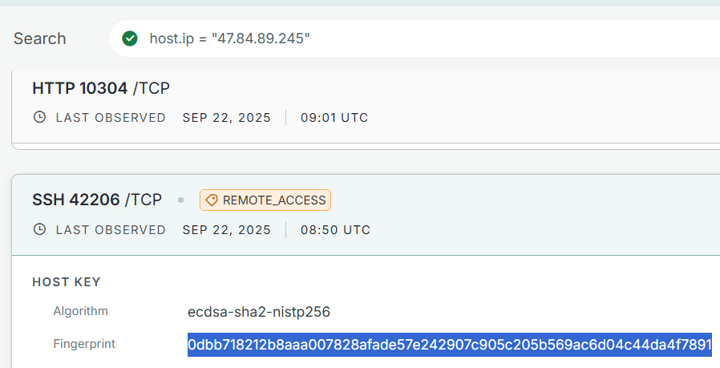
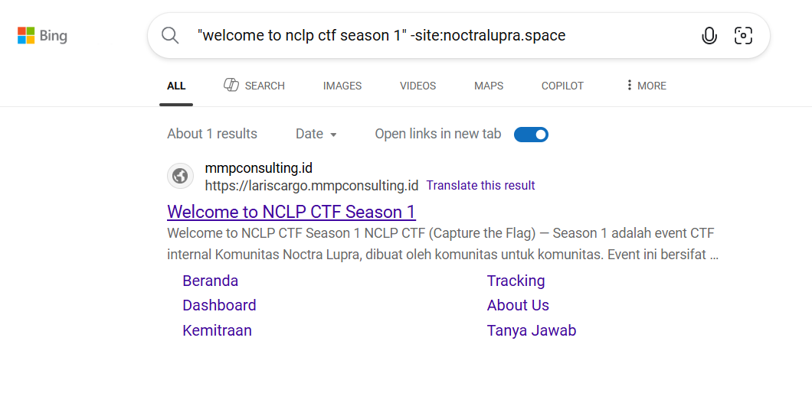
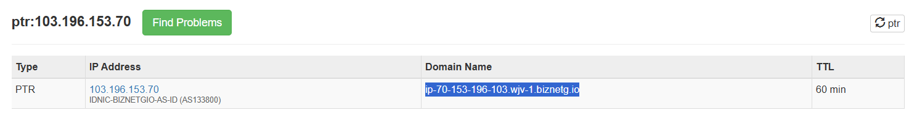
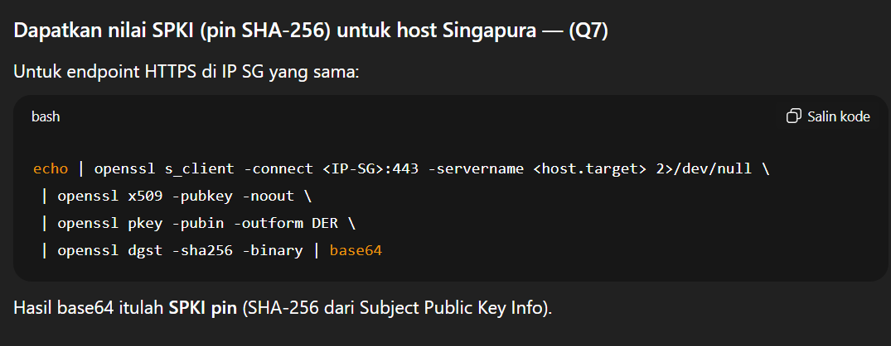
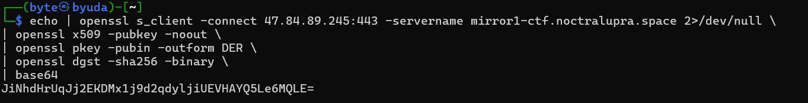

## platform
**Difficulty:** Medium
**Author:** moonetics

### Description
Find information from this platform.

Question 1
Apa IP publik host yang berada di Singapura?

Question 2
Berapa ASN number untuk host di Singapura?

Question 3
Apa Website yang tercantum pada profil ASN tersebut?

Question 4
Apa Fingerprint host key SSH (ECDSA) dari host Singapura?

Question 5
Sebutkan satu domain non-noctralupra yang ikut menyajikan halaman?

Question 6
Apa Reverse DNS dari host yang berada di West Java?

Question 7
Apa nilai SPKI untuk host yang berada di Singapura?

### Solution

Dengan nslookup ditemukan ip dari web mirror yang di singapura `47.84.89.245` (soal 1). Ditemukan juga asn numbernya `AS45102` (soal 2). Karena dari nslookup mengatakan kalo ini dari Alibaba maka websitenya adalah `alibabagroup.com` (soal 3)

Dengan menggunakan censys.io ditemukan ssh fingerprint nya adalah `0dbb718212b8aaa007828afade57e242907c905c205b569ac6d04c44da4f7891` (soal 4).

Saya harus menggunakan teknik dorking untuk ini, karena kemungkinan domain bisa memakai http saja maka saya menggunakan bing untuk dorkingnya karena bing bisa indexing http. Ditemukan domainnya adalah `mmpconsulting.id` (soal 5).

Dengan menggunakan tools (https://mxtoolbox.com/SuperTool.aspx?action=ptr%3a103.196.153.70&run=toolpage) didapatkan reverse dns yang di west java adalah `ip-70-153-196-103.wjv-1.biznetg.io` (soal 6).

Karena tidak tau apa itu spki saya tanya gpt dan didapatkan caranya dengan command diatas. Outputnya adalah `JiNhdHrUqJj2EKDMx1j9d2qdyljiUEVHAYQ5Le6MQLE=` (soal 7).
