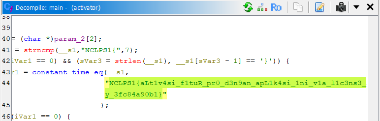

## Activator
**Difficulty:** Baby
**Author:** moonetics

### Description
CLI kecil untuk mengaktifkan fitur “Pro” menggunakan license key berformat khusus. Aplikasi menyimpan status aktivasi ke file marker lokal dan menyediakan perintah untuk melihat status saat ini. Dirancang untuk berjalan di Linux/macOS (x86_64) pada mode rilis.

### Solution

Didapatkan file ELF, dan ketika di-decompile menggunakan ghidra ternyata flagnya di-hardcode di main function

### Flag
NCLPS1{aLt1v4si_f1tuR_pr0_d3n9an_apL1k4si_1ni_v1a_l1c3ns3_k3y_3fc84a90b1}
