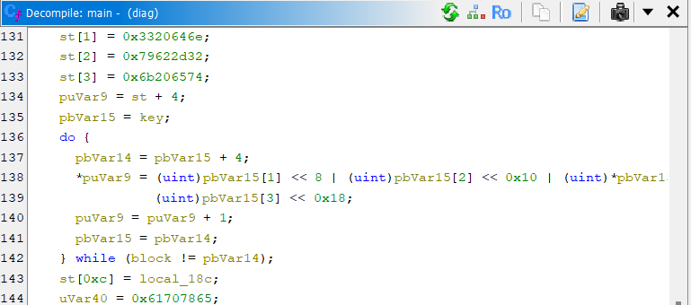

## Endpoint Diagnostic
**Difficulty:** Easy-Medium
**Author:** n4siKvn1ng

### Description
Perusahaan sedang menjalani audit operasional dan kepatuhan. Dalam rangka verifikasi alur onboarding endpoint, tim GRC meminta Infra menjalankan sebuah utilitas diagnostik (diag) di beberapa host untuk memastikan bootstrap handshake ke layanan audit berjalan benar.

Sebagai engineer yang ditugaskan untuk health-check integrasi, Anda perlu membuktikan bahwa token tersebut benar-benar terbentuk saat proses berjalan

### Solution


Hasil decompile memperlihatkan hanya dua fungsi `int main(void)` dan `void* eraser(void*)`. Indikasi ChaCha20 tampak jelas dari konstanta state: `0x61707865`, `0x3320646e`, `0x79622d32`, `0x6b206574` ("expand 32-byte k") serta pola rotasi **16, 12, 8, 7** pada ronde.

```c
int main(void)

{
  byte bVar1;
  uint32_t uVar2;
  int iVar3;
  size_t sVar4;
  size_t __len;
  void *__addr;
  uint32_t *puVar5;
  uint uVar6;
  uint32_t uVar7;
  uint32_t *puVar8;
  uint *puVar9;
  uint32_t *puVar10;
  uint uVar11;
  uint32_t uVar12;
  uint32_t uVar13;
  byte *pbVar14;
  byte *pbVar15;
  uint32_t uVar16;
  uint uVar17;
  uint uVar18;
  uint32_t uVar19;
  ulong uVar20;
  uint uVar21;
  uint uVar22;
  uint32_t uVar23;
  uint uVar24;
  uint32_t uVar25;
  uint uVar26;
  uint32_t uVar27;
  uint uVar28;
  uint uVar29;
  uint32_t uVar30;
  uint uVar31;
  uint uVar32;
  uint uVar33;
  uint32_t uVar34;
  uint uVar35;
  uint32_t uVar36;
  uint uVar37;
  uint32_t uVar38;
  uint uVar39;
  uint32_t uVar40;
  uint32_t uVar41;
  uint32_t uVar42;
  long in_FS_OFFSET;
  uint32_t *local_1a8;
  uint32_t local_18c;
  ulong local_178;
  int local_170;
  uint local_16c;
  uint local_168;
  uchar sink;
  pthread_t th;
  timespec ts;
  uint32_t st [16];
  uint32_t w [16];
  uint32_t local_b8;
  uint8_t nonce [12];
  uint8_t key [32];
  uint8_t block [64];
  byte local_48 [8];
  long local_40;
  
  local_40 = *(long *)(in_FS_OFFSET + 0x28);
  sVar4 = sysconf(0x1e);
  __len = 0x1000;
  if (0 < (long)sVar4) {
    __len = sVar4;
  }
  g_pagesz = __len;
  __addr = mmap((void *)0x0,__len,3,0x22,-1,0);
  g_page = __addr;
  if (__addr == (void *)0xffffffffffffffff) {
    perror("mmap");
                    /* WARNING: Subroutine does not return */
    exit(1);
  }
  g_len = 0x6f;
  puVar8 = K32;
  uVar40 = 0xf3a4985c;
  g_slot = (uchar *)((long)__addr + 0x80);
  pbVar15 = key;
  while( true ) {
    puVar8 = puVar8 + 1;
    *pbVar15 = (byte)uVar40;
    pbVar15[1] = (byte)(uVar40 >> 8);
    pbVar15[2] = (byte)(uVar40 >> 0x10);
    pbVar15[3] = (byte)(uVar40 >> 0x18);
    if (block == pbVar15 + 4) break;
    uVar40 = *puVar8;
    pbVar15 = pbVar15 + 4;
  }
  uVar40 = 0x642d636e;
  puVar8 = N32;
  pbVar15 = nonce;
  while( true ) {
    *pbVar15 = (byte)uVar40;
    puVar8 = puVar8 + 1;
    pbVar15[1] = (byte)(uVar40 >> 8);
    pbVar15[2] = (byte)(uVar40 >> 0x10);
    pbVar15[3] = (byte)(uVar40 >> 0x18);
    if (key == pbVar15 + 4) break;
    uVar40 = *puVar8;
    pbVar15 = pbVar15 + 4;
  }
  local_178 = 0;
  local_18c = 0;
  *(undefined8 *)((long)__addr + 0x80) = 0xefb14c149b3b4c26;
  *(undefined8 *)((long)__addr + 0x88) = 0xe0edbcb7cb626545;
  *(undefined8 *)((long)__addr + 0xe0) = 0x3aa52facabd39adc;
  *(undefined2 *)((long)__addr + 0xec) = 0xfd28;
  *(undefined8 *)((long)__addr + 0x90) = 0x911828a0c531f0fa;
  *(undefined8 *)((long)__addr + 0x98) = 0xe943cbeb55318fef;
  *(undefined8 *)((long)__addr + 0xa0) = 0x56b7e88bf70ca1e1;
  *(undefined8 *)((long)__addr + 0xa8) = 0x4b4c5d59225dcdc3;
  *(undefined8 *)((long)__addr + 0xb0) = 0x924a239c4cf45e3d;
  *(undefined8 *)((long)__addr + 0xb8) = 0x475fb0e3eb6dc589;
  *(undefined8 *)((long)__addr + 0xc0) = 0xe72f86321c753556;
  *(undefined8 *)((long)__addr + 200) = 0xe3658eca2d7018e3;
  *(undefined4 *)((long)__addr + 0xe8) = 0xade78656;
  *(undefined1 *)((long)__addr + 0xee) = 10;
  *(undefined8 *)((long)__addr + 0xd0) = 0x706bebda72e20067;
  *(undefined8 *)((long)__addr + 0xd8) = 0xae4e6ee42ac766c5;
  do {
    st[1] = 0x3320646e;
    st[2] = 0x79622d32;
    st[3] = 0x6b206574;
    puVar9 = st + 4;
    pbVar15 = key;
    do {
      pbVar14 = pbVar15 + 4;
      *puVar9 = (uint)pbVar15[1] << 8 | (uint)pbVar15[2] << 0x10 | (uint)*pbVar15 |
                (uint)pbVar15[3] << 0x18;
      puVar9 = puVar9 + 1;
      pbVar15 = pbVar14;
    } while (block != pbVar14);
    st[0xc] = local_18c;
    uVar40 = 0x61707865;
    st[0xd]._0_1_ = nonce[0];
    st[0xd]._1_1_ = nonce[1];
    st[0xd]._2_1_ = nonce[2];
    st[0xd]._3_1_ = nonce[3];
    st._56_8_ = nonce._4_8_;
    puVar8 = st + 1;
    puVar10 = w;
    while( true ) {
      *puVar10 = uVar40;
      puVar10 = puVar10 + 1;
      if (w == puVar8) break;
      uVar40 = *puVar8;
      puVar8 = puVar8 + 1;
    }
    local_170 = 10;
    local_16c = w[6];
    local_168 = w[7];
    uVar40 = w[0];
    uVar30 = w[4];
    uVar7 = w[0xc];
    uVar23 = w[8];
    uVar27 = w[1];
    uVar34 = w[5];
    uVar12 = w[0xd];
    uVar19 = w[9];
    uVar25 = w[2];
    uVar2 = w[0xe];
    uVar38 = w[10];
    uVar16 = w[3];
    uVar42 = w[0xf];
    uVar36 = w[0xb];
    do {
      uVar11 = uVar12 ^ uVar27 + uVar34;
      uVar6 = uVar7 ^ uVar40 + uVar30;
      uVar11 = uVar11 << 0x10 | uVar11 >> 0x10;
      uVar6 = uVar6 << 0x10 | uVar6 >> 0x10;
      uVar17 = uVar19 + uVar11;
      uVar21 = uVar23 + uVar6;
      uVar31 = uVar34 ^ uVar17;
      uVar28 = uVar30 ^ uVar21;
      uVar32 = uVar31 << 0xc | uVar31 >> 0x14;
      uVar31 = uVar28 << 0xc | uVar28 >> 0x14;
      uVar26 = uVar27 + uVar34 + uVar32;
      uVar39 = uVar40 + uVar30 + uVar31;
      uVar11 = uVar11 ^ uVar26;
      uVar6 = uVar6 ^ uVar39;
      uVar28 = uVar11 << 8 | uVar11 >> 0x18;
      uVar11 = uVar6 << 8 | uVar6 >> 0x18;
      uVar17 = uVar17 + uVar28;
      uVar21 = uVar21 + uVar11;
      uVar32 = uVar32 ^ uVar17;
      uVar31 = uVar31 ^ uVar21;
      uVar29 = uVar31 << 7 | uVar31 >> 0x19;
      uVar33 = uVar32 << 7 | uVar32 >> 0x19;
      uVar6 = uVar2 ^ uVar25 + local_16c;
      uVar6 = uVar6 << 0x10 | uVar6 >> 0x10;
      uVar37 = uVar38 + uVar6;
      uVar31 = local_16c ^ uVar37;
      uVar32 = uVar31 << 0xc | uVar31 >> 0x14;
      uVar24 = uVar25 + local_16c + uVar32;
      uVar6 = uVar6 ^ uVar24;
      uVar6 = uVar6 << 8 | uVar6 >> 0x18;
      uVar31 = uVar42 ^ local_168 + uVar16;
      uVar39 = uVar39 + uVar33;
      uVar37 = uVar37 + uVar6;
      uVar31 = uVar31 << 0x10 | uVar31 >> 0x10;
      uVar32 = uVar32 ^ uVar37;
      uVar35 = uVar36 + uVar31;
      uVar22 = uVar32 << 7 | uVar32 >> 0x19;
      uVar32 = local_168 ^ uVar35;
      uVar26 = uVar26 + uVar22;
      uVar18 = uVar32 << 0xc | uVar32 >> 0x14;
      uVar11 = uVar11 ^ uVar26;
      uVar32 = local_168 + uVar16 + uVar18;
      uVar11 = uVar11 << 0x10 | uVar11 >> 0x10;
      uVar31 = uVar31 ^ uVar32;
      uVar31 = uVar31 << 8 | uVar31 >> 0x18;
      uVar35 = uVar35 + uVar31;
      uVar31 = uVar31 ^ uVar39;
      uVar31 = uVar31 << 0x10 | uVar31 >> 0x10;
      uVar18 = uVar18 ^ uVar35;
      uVar35 = uVar35 + uVar11;
      uVar37 = uVar37 + uVar31;
      uVar22 = uVar22 ^ uVar35;
      uVar18 = uVar18 << 7 | uVar18 >> 0x19;
      uVar33 = uVar33 ^ uVar37;
      uVar33 = uVar33 << 0xc | uVar33 >> 0x14;
      uVar40 = uVar39 + uVar33;
      uVar31 = uVar31 ^ uVar40;
      uVar42 = uVar31 << 8 | uVar31 >> 0x18;
      uVar38 = uVar37 + uVar42;
      uVar33 = uVar33 ^ uVar38;
      uVar34 = uVar33 << 7 | uVar33 >> 0x19;
      uVar31 = uVar22 << 0xc | uVar22 >> 0x14;
      uVar24 = uVar24 + uVar18;
      uVar27 = uVar26 + uVar31;
      uVar28 = uVar28 ^ uVar24;
      uVar11 = uVar11 ^ uVar27;
      uVar28 = uVar28 << 0x10 | uVar28 >> 0x10;
      uVar7 = uVar11 << 8 | uVar11 >> 0x18;
      uVar36 = uVar35 + uVar7;
      uVar31 = uVar31 ^ uVar36;
      local_16c = uVar31 << 7 | uVar31 >> 0x19;
      uVar21 = uVar21 + uVar28;
      uVar18 = uVar18 ^ uVar21;
      uVar11 = uVar18 << 0xc | uVar18 >> 0x14;
      uVar25 = uVar24 + uVar11;
      uVar28 = uVar28 ^ uVar25;
      uVar12 = uVar28 << 8 | uVar28 >> 0x18;
      uVar23 = uVar21 + uVar12;
      uVar11 = uVar11 ^ uVar23;
      local_168 = uVar11 << 7 | uVar11 >> 0x19;
      uVar32 = uVar29 + uVar32;
      uVar6 = uVar6 ^ uVar32;
      uVar6 = uVar6 << 0x10 | uVar6 >> 0x10;
      uVar17 = uVar17 + uVar6;
      uVar29 = uVar29 ^ uVar17;
      uVar11 = uVar29 << 0xc | uVar29 >> 0x14;
      uVar16 = uVar32 + uVar11;
      uVar6 = uVar6 ^ uVar16;
      uVar2 = uVar6 << 8 | uVar6 >> 0x18;
      uVar19 = uVar17 + uVar2;
      uVar11 = uVar11 ^ uVar19;
      uVar30 = uVar11 << 7 | uVar11 >> 0x19;
      local_170 = local_170 + -1;
    } while (local_170 != 0);
    uVar13 = 0x61707865;
    puVar8 = w;
    puVar10 = st + 1;
    uVar41 = uVar40;
    while( true ) {
      puVar5 = puVar8 + 1;
      *puVar8 = uVar41 + uVar13;
      pbVar15 = block;
      local_1a8 = w;
      if (&local_b8 == puVar5) break;
      uVar41 = *puVar5;
      uVar13 = *puVar10;
      puVar10 = puVar10 + 1;
      puVar8 = puVar5;
    }
    do {
      pbVar14 = pbVar15 + 4;
      uVar41 = *local_1a8;
      *pbVar15 = (byte)uVar41;
      pbVar15[1] = (byte)(uVar41 >> 8);
      pbVar15[2] = (byte)(uVar41 >> 0x10);
      pbVar15[3] = (byte)(uVar41 >> 0x18);
      pbVar15 = pbVar14;
      local_1a8 = local_1a8 + 1;
    } while (local_48 != pbVar14);
    uVar20 = 0x6f - local_178;
    if (0x40 < uVar20) {
      uVar20 = 0x40;
    }
    pbVar15 = (byte *)((long)__addr + local_178 + 0x80);
    pbVar14 = block;
    do {
      bVar1 = *pbVar14;
      pbVar14 = pbVar14 + 1;
      *pbVar15 = *pbVar15 ^ bVar1;
      pbVar15 = pbVar15 + 1;
    } while (block + uVar20 != pbVar14);
    local_178 = local_178 + uVar20;
    local_18c = local_18c + 1;
    w[0] = uVar40;
    w[1] = uVar27;
    w[2] = uVar25;
    w[3] = uVar16;
    w[4] = uVar30;
    w[5] = uVar34;
    w[6] = local_16c;
    w[7] = local_168;
    w[8] = uVar23;
    w[9] = uVar19;
    w[10] = uVar38;
    w[0xb] = uVar36;
    w[0xc] = uVar7;
    w[0xd] = uVar12;
    w[0xe] = uVar2;
    w[0xf] = uVar42;
  } while (local_178 < 0x6f);
  iVar3 = mprotect(__addr,__len,1);
  if (iVar3 != 0) {
    perror("mprotect");
  }
  iVar3 = pthread_create(&th,(pthread_attr_t *)0x0,eraser,(void *)0x0);
  if (iVar3 != 0) {
    perror("pthread_create");
  }
  else {
    write(1,"[audit] handshake: ready\n",0x19);
    ts.tv_sec = 2;
    ts.tv_nsec = 0;
    nanosleep((timespec *)&ts,(timespec *)0x0);
    pthread_join(th,(void **)0x0);
  }
  if (local_40 != *(long *)(in_FS_OFFSET + 0x28)) {
                    /* WARNING: Subroutine does not return */
    __stack_chk_fail();
  }
  return (uint)(iVar3 != 0);
}
```

Alur `main` :
1. Menentukan ukuran halaman (`sysconf`), lalu `mmap` halaman anonim RW dan menyimpannya di global `g_page`. Pointer payload slot diset ke `g_slot = g_page + 0x80`, panjang `g_len = 0x6f` (111 byte).
2. Mengisi `key[32]` dari array 32‑bit `K32` dan `nonce[12]` dari `N32`.
3. Menulis blok data awal (ciphertext) ke `g_slot` melalui serangkaian `*(u64*)(g_page+offset) = ...`.
4. Menghasilkan keystream ChaCha20 per 64‑byte ke dalam `block[64]`, lalu melakukan XOR ke `g_slot` sebanyak `g_len` byte. Inilah tahap dekripsi token.
5. Memanggil `mprotect(g_page, g_pagesz, PROT_READ)`, mengubah halaman menjadi read‑only.
6. Membuat thread `eraser`, lalu segera mencetak `"[audit] handshake: ready\n"` dan tidur 2 detik.

```c
void * eraser(void *arg)

{
  long lVar1;
  void *__addr;
  uchar *__s;
  char *pcVar2;
  long in_FS_OFFSET;
  timespec ts;
  
  lVar1 = *(long *)(in_FS_OFFSET + 0x28);
  ts.tv_sec = 0;
  ts.tv_nsec = 700000000;
  nanosleep((timespec *)&ts,(timespec *)0x0);
  __s = g_slot;
  __addr = g_page;
  if ((g_slot != (uchar *)0x0) && (g_page != (void *)0x0)) {
    pcVar2 = getenv("DIAG_SAFE_ERASE");
    if (pcVar2 != (char *)0x0) {
      mprotect(__addr,g_pagesz,3);
    }
    memset(__s,0,g_len);
    ts.tv_nsec = 120000000;
    nanosleep((timespec *)&ts,(timespec *)0x0);
    munmap(g_page,g_pagesz);
    g_page = (void *)0x0;
    g_slot = (uchar *)0x0;
  }
  if (lVar1 == *(long *)(in_FS_OFFSET + 0x28)) {
    return (void *)0x0;
  }
                    /* WARNING: Subroutine does not return */
  __stack_chk_fail();
}
```

Alur `eraser`:
* Sleep **700 ms**,
* Jika environment `DIAG_SAFE_ERASE` ADA, maka lakukan `mprotect(g_page, g_pagesz, PROT_READ|PROT_WRITE)` supaya bisa menulis,
* `memset(g_slot, 0, g_len)`, nolka token,
* Sleep **120 ms**, lalu `munmap(g_page, g_pagesz)`.

Token didekripsi penuh ke RAM (anonymous `mmap`) dan selama \~700 ms **bisa dibaca** oleh debugger. Proteksi yang ada membuat halaman RO tidak mencegah pembacaan, hanya penulisan. Karena:

* Tidak ada anti‑debug/anti‑dump (`prctl(PR_SET_DUMPABLE,0)`, seccomp, YAMA ptrace),
* Dekripsi terjadi di alamat proses,
* Waktu antara cetak handshake dan `eraser` menolkan cukup lebar.

Tanpa mengandalkan simbol global, kita pakai **syscall catch** untuk memperoleh address halaman.
Solver ini menjalankan `./diag`, menunggu `handshake` muncul di stdout, segera **SIGSTOP**, memindai `mem` untuk pola flag `NCLPS1{...}`, lalu **SIGCONT** agar proses lanjut normal.

```python
import os, re, sys, fcntl, signal, subprocess, time

PATTERN = re.compile(rb'NCLPS1\{[^}]+\}')
HANDSHAKE_HINT = b'handshake'

def nonblock(fd):
    import fcntl as F
    fl = F.fcntl(fd, F.F_GETFL)
    F.fcntl(fd, F.F_SETFL, fl | os.O_NONBLOCK)

def scan_mem(pid):
    hits = []
    with open(f'/proc/{pid}/maps') as mp, open(f'/proc/{pid}/mem','rb',0) as mem:
        for line in mp:
            rng, perms, *_ = line.split()
            if 'r' not in perms:
                continue
            start, end = (int(x,16) for x in rng.split('-'))
            try:
                mem.seek(start)
                data = mem.read(min(end-start, 8_000_000))
            except Exception:
                continue
            for m in PATTERN.finditer(data):
                hits.append((start + m.start(), m.group(0)))
    return hits

def main():
    p = subprocess.Popen(['./diag'], stdout=subprocess.PIPE, stderr=subprocess.PIPE)
    nonblock(p.stdout.fileno())
    buf=b''; t0=time.time(); carved=False
    while p.poll() is None:
        try:
            chunk = os.read(p.stdout.fileno(), 65536)
            if chunk:
                buf += chunk
                if b'handshake' in buf and not carved:
                    os.kill(p.pid, signal.SIGSTOP)
                    for addr, tok in scan_mem(p.pid):
                        print(f'[+] token @0x{addr:x}: {tok.decode()}')
                    os.kill(p.pid, signal.SIGCONT)
                    carved=True
        except BlockingIOError:
            pass
        if not carved and time.time()-t0 > 1.5: # fallback
            os.kill(p.pid, signal.SIGSTOP)
            for addr, tok in scan_mem(p.pid):
                print(f'[+] token (fallback) @0x{addr:x}: {tok.decode()}')
            os.kill(p.pid, signal.SIGCONT)
            carved=True
        time.sleep(0.01)

if __name__ == '__main__':
    main()
```

### Flag
NCLPS1{h4lo_s4aAt_1ni_p3rus4HaaN_seD4ng_m3LaKukan_4ud1t_moh0on_s3Lalu_m3ng1kutI_pr0tokol_p3rusahaan_91425d37c5}
