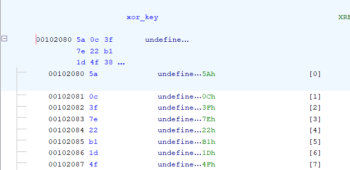
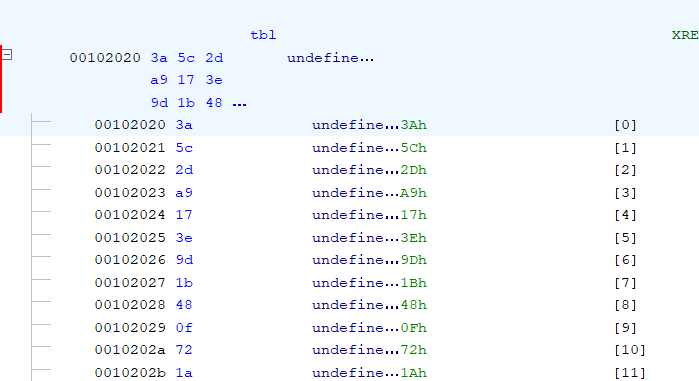
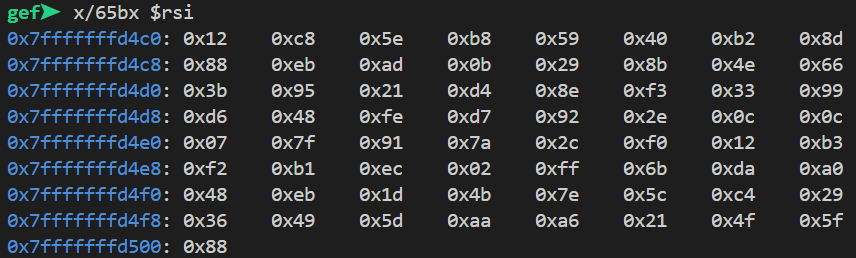

## Obfs
**Difficulty:** Medium
**Author:** moonetics

### Description
Legend says the author loved to hide secrets in plain sight, and enjoyed making puzzles only the most persistent could solve.

Can you uncover the secret message the author left behind?

### Solution
```c
  pcVar2 = fgets(local_58,0x43,stdin);
  if (pcVar2 == (char *)0x0) {
    uVar3 = 1;
  }
  else {
    sVar4 = strlen(local_58);
    local_14c = (int)sVar4;
    if (local_58[local_14c + -1] == '\n') {
      local_14c = local_14c + -1;
      local_58[local_14c] = '\0';
    }
    if (local_14c == 0x41) {
      extra_junk();
      confuse(local_58,local_148);
      mangle(local_148,local_f8,tbl);
      local_a8 = 0x8db24059b85ec812;
      local_a0 = 0x664e8b290badeb88;
      local_98 = 0x9933f38ed421953b;
      local_90 = 0xc0c2e92d7fe48d6;
      local_88 = 0xb312f02c7a917f07;
      local_80 = 0xa0da6bff02ecb1f2;
      local_78 = 0x29c45c7e4b1deb48;
      local_70 = 0x5f4f21a6aa5d4936;
      local_68 = 0x88;
      decoy_func(local_f8);
      iVar1 = validate(local_f8,&local_a8);
```

Dari decompile ghidra, didapatkan bahwa setelah memasukkan input, main akan membaca hingga 67 byte (fgets(buf,0x43,stdin)), memotong \n dan mengecek panjang = 0x41 (65). Jika panjang tidak cocok maka abort. Jika panjang benar, jalankan extra_junk() (noise), confuse(input, tmp1), mangle(tmp1, tmp2, tbl), set expected constants (8×64-bit + 1 byte), panggil decoy_func(tmp2) (hanya membaca, tidak mengubah), lalu validate(tmp2, expected) yang melakukan per-byte equality untuk 65 byte. Jika sama → "Nice! Flag accepted."

```c
  for (local_c = 0; (int)local_c < 0x41; local_c = local_c + 1) {
    bVar3 = xor_key[(int)local_c] ^ *(byte *)(param_1 + (int)local_c);
    cVar1 = (char)local_c;
    if ((local_c & 1) == 0) {
      local_d = (byte)((int)(uint)bVar3 >> (7U - (cVar1 + (char)((int)local_c / 5) * -5) & 0x1f)) |
                bVar3 << (cVar1 + (char)((int)local_c / 5) * -5 + 1U & 0x1f);
    }
    else {
      bVar2 = (byte)((int)local_c >> 0x1f);
      local_d = bVar3 << (7 - ((cVar1 + (bVar2 >> 6) & 3) - (bVar2 >> 6)) & 0x1f) |
                (byte)((int)(uint)bVar3 >> (((cVar1 + (bVar2 >> 6) & 3) - (bVar2 >> 6)) + 1 & 0x1f ))
      ;
    }
    *(byte *)((int)local_c + param_2) = local_d;
```

confuse melakukan b = xor_key[i] ^ in[i], lalu jika i genap: out[i] = rol(b, (i % 5) + 1); else out[i] = ror(b, (i & 3) + 1).

```c
void mangle(long param_1,long param_2,long param_3)

{
  undefined4 local_c;
  
  for (local_c = 0; local_c < 0x41; local_c = local_c + 1) {
    *(byte *)(param_2 + local_c) =
         *(byte *)(param_3 + (local_c * 7) % 0x41) ^ *(byte *)(param_1 + local_c);
  }
  return;
}
```

mangle melakukan out[i] = tbl[(i * 7) % 65] ^ in[i].

```c
undefined8 validate(long param_1,long param_2)

{
  int local_c;
  
  local_c = 0;
  while( true ) {
    if (0x40 < local_c) {
      return 1;
    }
    if (*(char *)(param_1 + local_c) != *(char *)(param_2 + local_c)) break;
    local_c = local_c + 1;
  }
  return 0;
}
```

validate melakukan for i in 0..64 if out[i] != expected[i] return false.




Ghidra juga menunjukkan lokasi data xor_key di 0x102080, tbl di 0x102020, dan konstanta target disusun di stack oleh main.



Dengan GDB didapatkan bytes target aktual yang digunakan runtime. Caranya adalah dengan memasang breakpoint di `validate` lalu `x/65bx $rsi` untuk mendapatkan `expected`

Solver berikut melakukan invert mangle (XOR dengan tbl[(i*7)%65]), invert rotasi (rotr/rol sesuai index parity), lalu XOR dengan xor_key untuk mendapatkan byte asli.

```python
from typing import List

def rol8(b: int, r: int) -> int:
    r %= 8
    return ((b << r) & 0xff) | ((b & 0xff) >> (8 - r))

def ror8(b: int, r: int) -> int:
    r %= 8
    return ((b & 0xff) >> r) | ((b << (8 - r)) & 0xff)

tbl = bytes([
  0x3a,0x5c,0x2d,0xa9,0x17,0x3e,0x9d,0x1b,0x48,0x0f,0x72,0x1a,0x36,0xe0,0xc5,0x7f,
  0x23,0x42,0x94,0x3b,0xf0,0x5a,0xb1,0xd8,0x15,0x81,0x2e,0x6d,0x77,0x6e,0xe7,0x55,
  0x34,0xc4,0x4b,0x60,0xab,0x20,0x98,0x7e,0x1d,0xf7,0x2b,0x51,0xcd,0x99,0x0c,0xbe,
  0x9f,0xaf,0x65,0x08,0x04,0x5e,0x16,0x84,0x38,0x1e,0x72,0xa1,0x3b,0x44,0x56,0x29,
  0x97
])

xor_key = bytes([
  0x5a,0x0c,0x3f,0x7e,0x22,0xb1,0x1d,0x4f,0x38,0x6e,0xa4,0xe7,0x2c,0xf1,0x0b,0xdc,
  0x55,0x6a,0x37,0xb9,0x19,0x99,0xab,0x8e,0x10,0x21,0xcb,0x14,0x8f,0xad,0xcd,0xea,
  0x42,0x3d,0x59,0x9c,0xbf,0xf3,0x81,0x50,0x73,0x47,0x99,0x34,0x62,0xd1,0x7c,0x16,
  0x44,0xc9,0x28,0xa8,0x79,0x1e,0xb7,0x12,0xff,0x2c,0x84,0x11,0x97,0x33,0x67,0x42,0xaa
])

expected = bytes([
  0x12,0xc8,0x5e,0xb8,0x59,0x40,0xb2,0x8d,0x88,0xeb,0xad,0x0b,0x29,0x8b,0x4e,0x66,
  0x3b,0x95,0x21,0xd4,0x8e,0xf3,0x33,0x99,0xd6,0x48,0xfe,0xd7,0x92,0x2e,0x0c,0x0c,
  0x07,0x7f,0x91,0x7a,0x2c,0xf0,0x12,0xb3,0xf2,0xb1,0xec,0x02,0xff,0x6b,0xda,0xa0,
  0x48,0xeb,0x1d,0x4b,0x7e,0x5c,0xc4,0x29,0x36,0x49,0x5d,0xaa,0xa6,0x21,0x4f,0x5f,
  0x88
])

def invert_transform(expected: bytes, tbl: bytes, xor_key: bytes) -> bytes:
    assert len(expected) == 65
    assert len(tbl) == 65
    assert len(xor_key) == 65
    out = bytearray(65)
    for i in range(65):
        idx = (i * 7) % 65
        confused = expected[i] ^ tbl[idx]
        if (i & 1) == 0:
            shift = (i % 5) + 1
            b = ror8(confused, shift)
        else:
            shift = (i & 3) + 1
            b = rol8(confused, shift)
        plain = b ^ xor_key[i]
        out[i] = plain & 0xff
    return bytes(out)

flag = invert_transform(expected, tbl, xor_key)
try:
    print(flag.decode('utf-8', errors='replace'))
except Exception as e:
    print("Could not decode cleanly:", e)
```

### Flag
NCLPS1{m3em4ng_k4dang_oBbfusc4t1on_m3nyer4mkan_ma4f_y_c395c67777}
