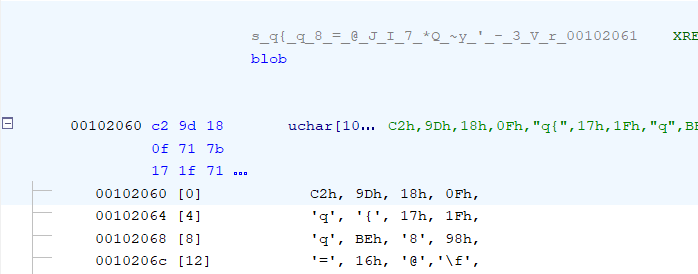

## Rotator
**Difficulty:** Easy - Medium
**Author:** moonetics

### Description
Sebuah layanan internal bernama rotator melakukan rotasi penanda (token) untuk penandatanganan webhook. Untuk menghindari downtime, proses mempertahankan dua slot memori dan berganti aktif–pasif saat rotasi berlangsung

### Solution
```c
int main(void)

{
  long lVar1;
  uchar *puVar2;
  size_t __len;
  uint uVar3;
  int iVar4;
  size_t __len_00;
  long lVar5;
  byte bVar6;
  long in_FS_OFFSET;
  pthread_t t1;
  pthread_t t2;
  timespec ts;
  
  lVar1 = *(long *)(in_FS_OFFSET + 0x28);
  __len_00 = sysconf(0x1e);
  if ((long)__len_00 < 1) {
    __len_00 = 0x1000;
  }
  g_pagesz = __len_00;
  g_page[0] = mmap((void *)0x0,__len_00,3,0x22,-1,0);
  if (g_page[0] != (void *)0xffffffffffffffff) {
    g_slot[0] = (uchar *)((long)g_page[0] + 0x100);
    g_page[1] = mmap((void *)0x0,__len_00,3,0x22,-1,0);
    if (g_page[1] != (void *)0xffffffffffffffff) {
      g_slot[1] = (uchar *)((long)g_page[1] + 0x100);
      g_len = 0x6b;
      bVar6 = 0xc2;
      puVar2 = g_slot[g_active];
      ks_state = 0xc0ffee5;
      lVar5 = 0;
      while( true ) {
        uVar3 = ks_state ^ ks_state << 0xd;
        uVar3 = uVar3 >> 0x11 ^ uVar3;
        ks_state = uVar3 << 5 ^ uVar3;
        puVar2[lVar5] = (byte)ks_state ^ (byte)lVar5 ^ bVar6;
        if (lVar5 + 1 == 0x6b) break;
        bVar6 = blob[lVar5 + 1];
        lVar5 = lVar5 + 1;
      }
      mprotect(g_page[g_active],__len_00,1);
      iVar4 = pthread_create(&t1,(pthread_attr_t *)0x0,loader_th,(void *)0x0);
      if (iVar4 == 0) {
        iVar4 = pthread_create(&t2,(pthread_attr_t *)0x0,rotator_th,(void *)0x0);
        if (iVar4 == 0) {
          write(1,"[rotator] ready\n",0x10);
          ts.tv_sec = 0;
          ts.tv_nsec = 2000000000;
          nanosleep((timespec *)&ts,(timespec *)0x0);
          pthread_cancel(t1);
          pthread_cancel(t2);
          pthread_join(t1,(void **)0x0);
          pthread_join(t2,(void **)0x0);
          __len = g_pagesz;
          munmap(g_page[0],g_pagesz);
          munmap(g_page[1],__len);
          iVar4 = 0;
        }
        else {
          iVar4 = 1;
          perror("pthread_create rotator");
        }
      }
      else {
        iVar4 = 1;
        perror("pthread_create loader");
      }
      goto LAB_001013bb;
    }
  }
  iVar4 = 1;
  perror("mmap");
LAB_001013bb:
  if (lVar1 == *(long *)(in_FS_OFFSET + 0x28)) {
    return iVar4;
  }
                    /* WARNING: Subroutine does not return */
  __stack_chk_fail();
}
```

Saat membuka ELF di Ghidra, di fungsi main terdapat beberapa pola terlihat, alokasi `mmap` untuk beberapa halaman, variabel global bernama `g_page` dan `g_slot`, dan dua fungsi yang berperan sebagai thread worker. 

```c
      while( true ) {
        uVar3 = ks_state ^ ks_state << 0xd;
        uVar3 = uVar3 >> 0x11 ^ uVar3;
        ks_state = uVar3 << 5 ^ uVar3;
        puVar2[lVar5] = (byte)ks_state ^ (byte)lVar5 ^ bVar6;
        if (lVar5 + 1 == 0x6b) break;
        bVar6 = blob[lVar5 + 1];
        lVar5 = lVar5 + 1;
      }
```

Di salah satu fungsi main ada loop yang menghasilkan byte token menggunakan operasi bitwise (shift/xor) dan menggabungkannya dengan byte dari sebuah array data besar yang berada di section .rodata.

### Di Ghidra



Di Ghidra saya memeriksa section headers lalu membuka **.rodata**. Di sana ada array byte panjang (`blob`) yang dicurigai digunakan sebagai key/seed karena ukurannya cocok dan ada XREF ke fungsi generator. 

```c
void * loader_th(void *arg)

{
  uchar *puVar1;
  size_t sVar2;
  uint uVar3;
  size_t sVar4;
  byte bVar5;
  int iVar6;
  timespec ts;
  
  do {
    g_busy = 1;
    iVar6 = 1 - g_active;
    mprotect(g_page[iVar6],g_pagesz,3);
    sVar2 = g_len;
    ks_state = 0xc0ffee5;
    puVar1 = g_slot[iVar6];
    if (g_len != 0) {
      bVar5 = 0xc2;
      ks_state = 0xc0ffee5;
      sVar4 = 0;
      while( true ) {
        uVar3 = ks_state ^ ks_state << 0xd;
        uVar3 = uVar3 >> 0x11 ^ uVar3;
        ks_state = uVar3 << 5 ^ uVar3;
        puVar1[sVar4] = (byte)ks_state ^ (byte)sVar4 ^ bVar5;
        if (sVar2 == sVar4 + 1) break;
        bVar5 = blob[sVar4 + 1];
        sVar4 = sVar4 + 1;
      }
    }
    ts.tv_sec = 0;
    ts.tv_nsec = 30000000;
    nanosleep((timespec *)&ts,(timespec *)0x0);
    mprotect(g_page[iVar6],g_pagesz,1);
    ts.tv_sec = 0;
    ts.tv_nsec = 70000000;
    g_busy = 0;
    nanosleep((timespec *)&ts,(timespec *)0x0);
  } while( true );
}
```

Dengan menavigasi cross references dari alamat array akan mengarah ke fungsi pembuatan token (loader_th). Dari decompile menunjukkan pola:
- sebuah variabel di-set `0x0c0ffee5` (seed PRNG)
- iterasi 0..N menghasilkan nilai `eax` melalui operasi `eax ^= eax << 13; eax ^= eax >> 17; eax = eax ^ (eax << 5)`
- setiap byte output = `(eax ^ i ^ blob[i_or_special_case]) & 0xff`

Dari sini jelas bahwa token dapat diprediksi bila kita punya `blob`.

Karena token tersimpan di binary (readable di .rodata) dan algoritmanya dapat diprediksi dengan seed konstan. Kombinasi ini memungkinkan pembuatan ulang token tanpa perlu race condition. Step exploitnya:

1. Temukan offset/isi `blob` di section .rodata.
2. Tiru generator PRNG dan lakukan operasi `out[i] = (eax ^ i ^ blob_byte) & 0xff` untuk semua i.
3. Decode hasil menjadi ASCII.

Di bawah ini adalah solvernya:

```python
blob_hex = "c29d180f717b171f71be38983d16400cdeded64ad495a4e98f498a37202a51857e79c427b32dc0f233e5999b56c67219beddb32d1150f095e11018d1399f10c4049f2c44db0e3037a46a316dc3d01f6c8108ccc623b70e466930db58285d4f188cf13cb3c563935d33122900"
blob = bytes.fromhex(blob_hex)
assert len(blob) == 108

def recover(blob):
    out = []
    eax = 0x0c0ffee5
    for i in range(0x6b):
        esi = (0xffffffc2 & 0xffffffff) if i == 0 else blob[i]
        ecx = eax
        ecx = ((ecx << 13) & 0xffffffff) ^ ecx
        ecx = (ecx ^ (ecx >> 17)) & 0xffffffff
        eax = ((ecx << 5) & 0xffffffff) ^ ecx
        byte = (eax ^ i ^ esi) & 0xff
        out.append(byte)
    return bytes(out)

print(recover(blob).decode())
```

### Flag
NCLPS1{pee_balap._k3ren_k4mu_b1s4_m3nYeL3s41kan_R4ce_c0nd1Tion_4tau_kAmu_DeCrYpt_buk4n_bypass?_770c130987}
