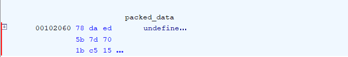

## Sentinels

**Difficulty:** Hard
**Author:** moonetics

### Description

An urgent, encrypted brief arrives from a trusted contact inside the research collective known as “Sentinels,” explaining that the network’s automated gatekeeper—powered by a compact executable that enforces the Sentinel authentication routine—has begun denying even authorized maintenance traffic, and unless someone off-site can quickly dissect the program, understand how the Sentinel validates visitors, and devise a discreet workaround, the team risks being locked out during an impending solar-storm blackout that would leave critical systems untended.

### Solution

```c
undefined8 main(undefined8 param_1,undefined8 param_2,char **param_3)
{
  int iVar1;
  void *__buf;
  long lVar2;
  size_t sVar3;
  long in_FS_OFFSET;
  size_t local_50;
  char *local_48;
  undefined8 local_40;
  long local_30;
  
  local_30 = *(long *)(in_FS_OFFSET + 0x28);
  __buf = malloc(0x3f60);
  if (__buf == (void *)0x0) {
    perror("malloc");
  }
  else {
    local_50 = 0x3f60;
    iVar1 = uncompress(__buf,&local_50,packed_data,0xbd6);
    if (iVar1 == 0) {
      lVar2 = syscall(0x13f,"sentinel",1);
      iVar1 = (int)lVar2;
      if (iVar1 < 0) {
        perror("memfd_create");
      }
      else {
        sVar3 = write(iVar1,__buf,local_50);
        if (sVar3 == local_50) {
          local_48 = "sentinel";
          local_40 = 0;
          fexecve(iVar1,&local_48,param_3);
          perror("fexecve");
        }
        else {
          perror("write");
        }
      }
    }
    else {
      fwrite("[-] zlib inflate failed\n",1,0x18,stderr);
    }
  }
  if (local_30 == *(long *)(in_FS_OFFSET + 0x28)) {
    return 1;
  }
  __stack_chk_fail();
}
```

Dari fungsi main pada ELF sentinelz ditemukan bahwa program melakukan dekompresi blob (`uncompress`) ke buffer, lalu membuat memfd, menulis hasil dekompresi ke memfd, dan menjalankan ELF hasil dekompresi via `fexecve`. Dengan kata lain, kita harus mengekstrak ELF kedua untuk dianalisis.


Berdasarkan hasil `readelf -S sentinelz`, section `.rodata` berada di `0x2000` dengan file offset `0x2000`. 



Dari decompile, `packed_data` ada di `0x2060` dengan ukuran `0xBD6` (3030 byte). Perhitungan file offset:

```bash
dd if=sentinelz bs=1 skip=8288 count=3030 of=packed.zlib
```

Dengan begitu dapat dilakukan ekstraksi dari compressed blob menggunakan command diatas.

```python
import zlib, pathlib
c = pathlib.Path('packed.zlib').read_bytes()
stage2 = zlib.decompress(c)
print("decompressed size:", len(stage2))
pathlib.Path('stage2.elf').write_bytes(stage2)
print("validate header:", stage2[:4])
```

Hasil `packed.zlib` kemudian di-decompress menggunakan kode diatas

Output menunjukkan ukuran hasil dekompresi `stage2.elf` sebesar **16224 bytes** dan validasi header dari ELF.

#### Analisis stage‑2 di Ghidra

```c
undefined8 main(void)

{
  uint uVar1;
  char *pcVar2;
  size_t sVar3;
  char *pcVar4;
  ulong uVar5;
  undefined8 uVar6;
  byte bVar7;
  long lVar8;
  char *__s;
  ulong uVar9;
  undefined1 *puVar10;
  long in_FS_OFFSET;
  byte bVar11;
  undefined1 local_168 [16];
  undefined1 local_158 [48];
  undefined1 local_128 [16];
  undefined1 local_118 [16];
  undefined1 local_108 [16];
  undefined1 local_f8 [16];
  undefined1 local_e8 [16];
  undefined1 local_d8 [16];
  undefined1 local_c8 [16];
  undefined1 local_b8 [16];
  undefined1 local_a8 [16];
  undefined1 local_98 [16];
  undefined1 local_88 [16];
  undefined1 local_78 [16];
  undefined1 local_68 [16];
  undefined1 local_58 [16];
  undefined1 local_48 [16];
  undefined1 local_38 [16];
  long local_20;
  
  bVar11 = 0;
  local_20 = *(long *)(in_FS_OFFSET + 0x28);
  local_128 = (undefined1  [16])0x0;
  __s = local_128;
  local_118 = (undefined1  [16])0x0;
  local_108 = (undefined1  [16])0x0;
  local_f8 = (undefined1  [16])0x0;
  local_e8 = (undefined1  [16])0x0;
  local_d8 = (undefined1  [16])0x0;
  local_c8 = (undefined1  [16])0x0;
  local_b8 = (undefined1  [16])0x0;
  local_a8 = (undefined1  [16])0x0;
  local_98 = (undefined1  [16])0x0;
  local_88 = (undefined1  [16])0x0;
  local_78 = (undefined1  [16])0x0;
  local_68 = (undefined1  [16])0x0;
  local_58 = (undefined1  [16])0x0;
  local_48 = (undefined1  [16])0x0;
  local_38 = (undefined1  [16])0x0;
  puts("== Sentinel Access Control ==");
  __printf_chk(1,"Password : ");
  pcVar2 = fgets(__s,0x80,stdin);
  if (pcVar2 != (char *)0x0) {
    pcVar2 = local_a8;
    sVar3 = strcspn(__s,"
");
    local_128[sVar3] = 0;
    __printf_chk(1,"Key      : ");
    pcVar4 = fgets(pcVar2,0x80,stdin);
    if (pcVar4 != (char *)0x0) {
      sVar3 = strcspn(pcVar2,"
");
      local_a8[sVar3] = 0;
      if (local_128[0] != 0) {
        uVar9 = 0xcbf29ce484222325;
        bVar7 = local_128[0];
        do {
          uVar5 = (ulong)bVar7;
          bVar7 = __s[1];
          __s = __s + 1;
          uVar5 = uVar5 ^ uVar9;
          uVar9 = uVar5 * 0x100000001b3;
        } while (bVar7 != 0);
        if ((uVar5 == 0x11d5438a8ef24722) && (local_a8[0] != 0)) {
          uVar9 = 0xcbf29ce484222325;
          bVar7 = local_a8[0];
          do {
            uVar5 = (ulong)bVar7;
            bVar7 = pcVar2[1];
            pcVar2 = pcVar2 + 1;
            uVar5 = uVar5 ^ uVar9;
            uVar9 = uVar5 * 0x100000001b3;
          } while (bVar7 != 0);
          if (uVar5 == 0x9ba9f4c0a1f2b4b6) {
            puVar10 = local_158;
            for (lVar8 = 0x2d; lVar8 != 0; lVar8 = lVar8 + -1) {
              *puVar10 = 0;
              puVar10 = puVar10 + (ulong)bVar11 * -2 + 1;
            }
            local_168 = (undefined1  [16])0x0;
            uVar1 = 0xcac7cf84;
            lVar8 = 0;
            do {
              uVar1 = uVar1 << 0xd ^ uVar1;
              uVar1 = uVar1 ^ uVar1 >> 0x11;
              uVar1 = uVar1 << 5 ^ uVar1;
              local_168[lVar8] = obf_flag[lVar8] ^ (byte)uVar1;
              lVar8 = lVar8 + 1;
            } while (lVar8 != 0x3c);
            puts("Welcome, Sentinel.");
            __printf_chk(1,"Flag: %s
",local_168);
            uVar6 = 0;
            goto LAB_00101350;
          }
        }
      }
      puts("Access denied.");
    }
  }
  uVar6 = 1;
LAB_00101350:
  if (local_20 == *(long *)(in_FS_OFFSET + 0x28)) {
    return uVar6;
  }
                    /* WARNING: Subroutine does not return */
  __stack_chk_fail();
}
```

Stage‑2 setelah di‑import ke Ghidra memperlihatkan implementasi FNV‑1a (loop XOR + multiply 0x100000001b3) untuk Password dan Key, lalu loop deobfuskasi xorshift32 (operasi shift/xor sesuai urutan) yang mengisi buffer `local_168` dari `obf_flag` menggunakan seed `0xCAC7CF84`, dan juga array `obf_flag` sepanjang 0x3C byte disimpan di `.rodata`

Selain itu, berikut dump `obf_flag` (lokasi `.rodata` di stage2: `0x00102080`)

```
b1 cd 4b 2c 85 fe fd e2 76 42 c5 8f f5 35 5b ef
72 1b 5a ba 50 91 e5 e1 7d d0 86 38 de 6e ef e2
d2 ad ab 13 e4 bb d6 3c a8 b7 2f d3 9b 25 2e b0
57 47 b9 b4 5a 46 04 3a 62 52 fd d2
```

Meskipun program meminta password & key, keduanya hanya menjadi syarat agar fungsi deobfuskasi dijalankan. Dengan begitu, proses itu dapat dipotong dan langsung menjalankan deobfuskasi sendiri. Saya mengimplementasikannya dalam solver berikut ini:

```python
import struct

SEED = 0xCAC7CF84
OBF_ADDR = 0x2080
OBF_LEN  = 0x3C

stage2 = open('stage2.elf','rb').read()

RO_VADDR = 0x2000
RO_FILEOFF = 0x2000
obf_off = OBF_ADDR - RO_VADDR + RO_FILEOFF
obf = stage2[obf_off:obf_off+OBF_LEN]

def xs32(x):
    x &= 0xffffffff
    x ^= (x << 13) & 0xffffffff
    x ^= (x >> 17) & 0xffffffff
    x ^= (x << 5) & 0xffffffff
    return x & 0xffffffff

x = SEED
out = bytearray()
for b in obf:
    x = xs32(x)
    out.append(b ^ (x & 0xff))

print(out.decode())
```

### Flag

NCLPS1{w3lcOme_s3ntinel_go0dd_tO_s3e_yo0uu_ag41n_485eb2be91}
