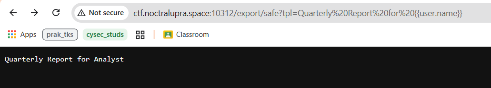
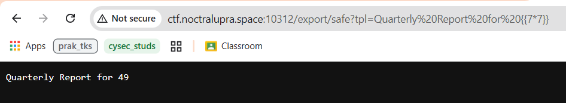
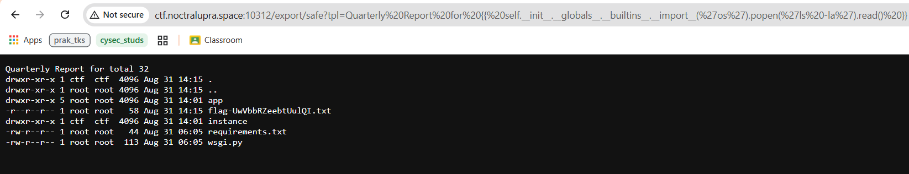
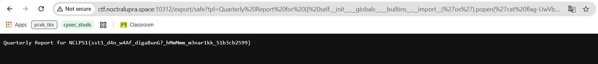

## Acme IntraMail

**Difficulty:** Medium

**Author:** moonetics

**URL:** [http://ctf.noctralupra.space:10312](http://ctf.noctralupra.space:10312)

### Description

Portal internal untuk pratinjau email dan direktori karyawan. Tugasmu meninjau source code, memahami alur pemrosesan input, dan menemukan cara memperoleh informasi rahasia yang tersimpan di server. Aplikasi tampak normal dan beberapa fitur bertindak sebagai pengalih.

### Solution



Pada awal pemeriksaan saya meninjau endpoint `reports` yang menampilkan konten berdasarkan query parameter. Dari source code yang ada, terlihat ada templating engine yang merender ekspresi `{{ user.name }}` sebagai `Analyst`. 



Ketika saya mengirim payload `{{7*7}}` hasilnya dieksekusi dan nilai `49` muncul pada halaman. 

Strategi berikutnya adalah untuk eskalasi SSTI menjadi RCE dengan mencari akses ke `__globals__` atau builtins, lalu memanggil `__import__` untuk memuat modul `os` atau `subprocess`. Dengan begitu kita bisa mengeksekusi perintah shell.

Untuk menguji hipotesis tersebut saya menggunakan payload SSTI yang memanggil import dari `os` lewat akses ke **globals** dan builtins. Payload yang saya pakai :

```
{{ self.__init__.__globals__.__builtins__.__import__('os').popen('ls -la').read() }}
```



Dengan cara ini, template engine akan memanggil `os.popen('ls -la').read()` dan mengembalikan daftar file dan direktori. 



Ditemukan file dengan nama `flag-UwVbbRZeebtUulQI.txt`. Dari situ saya mengganti perintah `ls -la` pada payload menjadi `cat` untuk membaca isi file flag tersebut. Payload untuk membaca flag:

```
{{ self.__init__.__globals__.__builtins__.__import__('os').popen('cat flag-UwVbbRZeebtUulQI.txt').read() }}
```

### Flag

NCLPS1{sst1_d4n_w4Af_digaBunG?_hMmMmm_m3nar1kk_51b3cb2599}


