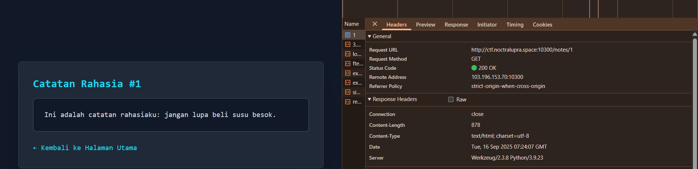
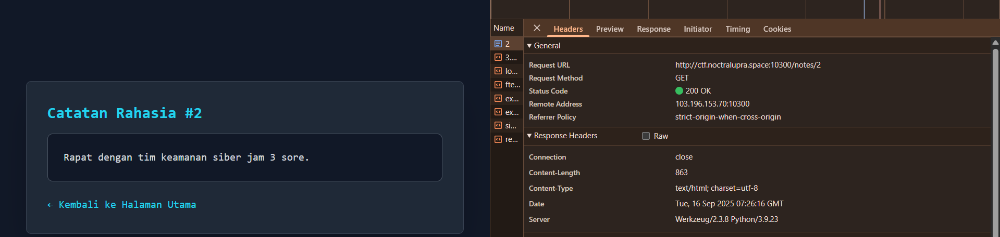
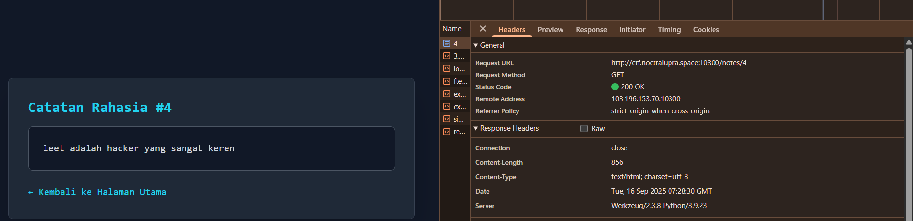
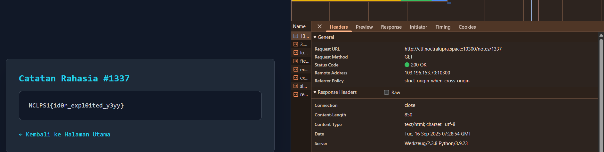

## AkuPintu

**Difficulty:** Easy

**Author:** maul

**URL:** [http://ctf.noctralupra.space:10300](http://ctf.noctralupra.space:10300)

### Description

Aku baru bikin projek buat nyimpen catetan hehe

### Solution

Saya memulai dengan membuka URL yang diberikan dan mengamati alur dasar aplikasi. Setelah click pada button `Lihat Catatan Rahasia Saya`, terlihat bahwa setiap catatan dapat diakses melalui endpoint yang bersifat numerik, misalnya `/notes/1`. Pola ini memberi sinyal kuat bahwa aplikasi mungkin rentan terhadap **Insecure Direct Object Reference (IDOR)**, di mana objek (resource) di-referensi secara langsung menggunakan identifier yang dapat ditebak.

Langkah berikutnya adalah menguji apakah server menerapkan otorisasi pada tiap resource. Saya mengganti angka pada URL dari `/notes/1` menjadi angka lain, misalnya `/notes/2`, tanpa mengubah sesi atau otorisasi khusus. Aplikasi tidak memvalidasi kepemilikan resource, maka konten note milik pengguna lain akan ditampilkan.

Dari sini, saya menelusuri beberapa ID lain secara manual untuk mencari petunjuk menuju flag. Pada note keempat (endpoint `/notes/4`), terdapat catatan yang menyebut kata *leet*. Kata kunci ini umum digunakan sebagai penanda angka **1337** dalam kultur “leet speak”. Dengan begitu, saya mencoba mengakses endpoint yang tidak biasa: `/notes/1337`.

Hasilnya, endpoint `/notes/1337` menampilkan isi note berisi flag.

### Flag

NCLPS1{id0r_expl0ited_y3yy}