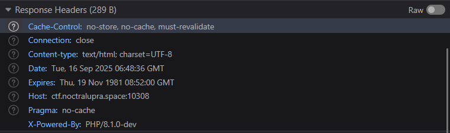
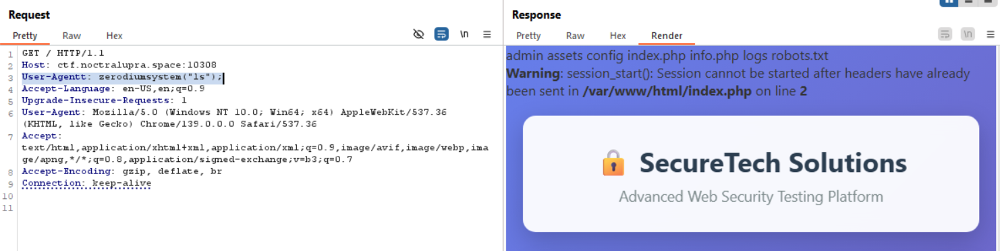

## EvilPHP
**Difficulty:** Easy
**Author:** maul
**URL:** [http://ctf.noctralupra.space:10308](http://ctf.noctralupra.space:10308)

### Description
Author minta jangan ada description

### Solution


Saya memulai proses recon terhadap layanan pada URL yang diberikan. Ditemukan pada response http headers bahwa tech stacknya menggunakan PHP/8.1.0-dev.  Karena versi tersebut tampak aneh, langkah berikutnya adalah mencari CVE yang terkait dengan versi PHP tersebut.

Saya mencari referensi online dan menemukan artikel yang relevan yang menjelaskan bahwa ada varian PHP 8.1.0-dev yang sudah diberi backdoor sehingga dapat RCE dari header tertentu. Referensi yang saya gunakan adalah contoh artikel teknis yang mendeskripsikan backdoor ini: [https://amsghimire.medium.com/php-8-1-0-dev-backdoor-cb224e7f5914](https://amsghimire.medium.com/php-8-1-0-dev-backdoor-cb224e7f5914). Dari artikel itu saya meniru payload yang memanfaatkan header `User-Agent` untuk melakukan RCE.

Saya mengirimkan permintaan HTTP ke server target dengan menambahkan header yang memanggil fungsi backdoor, contoh payload yang saya gunakan pada header adalah:

```
User-Agent: zerodiumsystem("ls");
```



Dengan begitu server mengeksekusi perintah `ls` dan mengembalikan outputnya di respon HTTP. Setelah konfirmasi bahwa eksekusi perintah bekerja, saya mengganti perintah menjadi pencarian file flag dan membaca isinya. Command yang saya kirimkan via header untuk mendapatkan isi file flag:

```
User-Agent: zerodiumsystem("cat /flag.txt");
```

Dengan begitu saya berhasil menemukan file flag dan membaca isinya langsung dari respon HTTP.

### Flag
NCLPS1{php_1n1_j4h4t_b4ng3ts}
