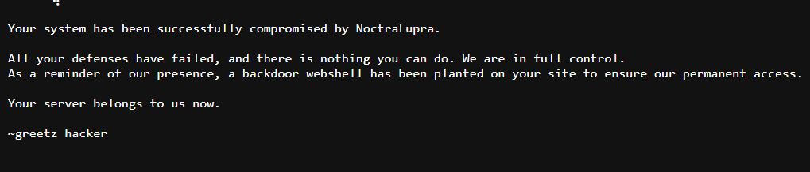
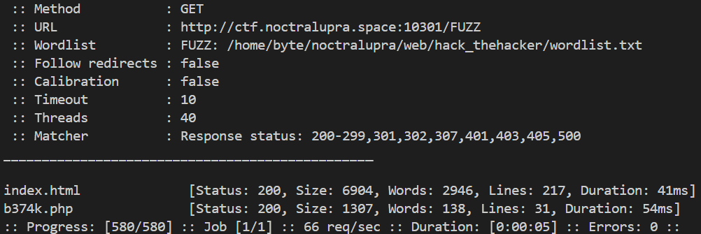
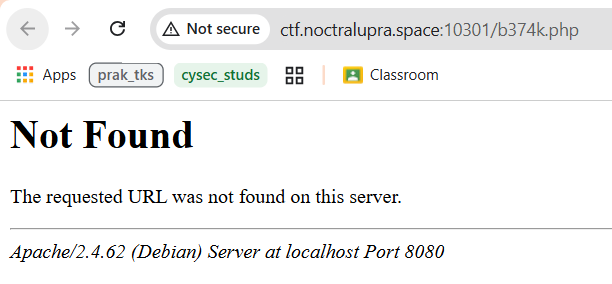
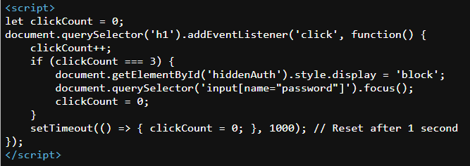
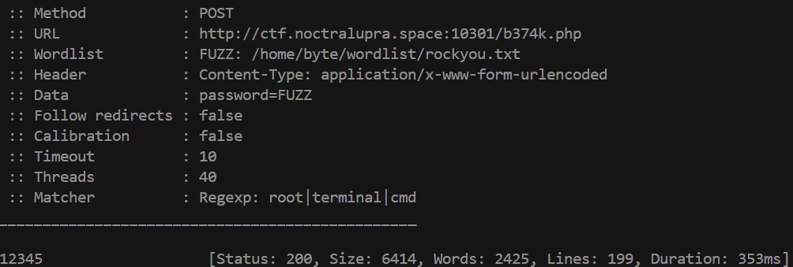

## Hack TheHacker

**Difficulty:** Easy

**Author:** maul

**URL:** [http://ctf.noctralupra.space:10301](http://ctf.noctralupra.space:10301)

### Description

NoctraLupra kembali beraksi!, mereka meretas company besar.......

Bisakah kamu meretas mereka??

### Solution



Web memperlihatkan pesan bahwa attacker menanam backdoor webshell, tetapi tidak ada petunjuk tentang lokasinya. Karena tidak ada informasi lebih lanjut tentang nama file webshell, langkah pertama adalah melakukan fuzzing path untuk menemukan file yang tersembunyi.

Saya menggunakan `ffuf` dengan wordlist yang memuat nama-nama umum webshell. Saya menggunakan wordlist dari proyek [shell-scan](https://github.com/Rhi7/shell-scan/blob/master/wordlist.txt). Perintah yang saya jalankan adalah seperti berikut:

```bash
ffuf -u http://ctf.noctralupra.space:10301/FUZZ -w /path/to/shell-scan-wordlist.txt
```



Dari hasil fuzzing ditemukan sebuah file `b374k.php`. 



Anehnya, `ffuf` mengembalikan status code 200 untuk file tersebut, tetapi ketika saya membukanya lewat browser, web menampilkan halaman 404. 



Ketika dilihat web source-nya, ditemukan sebuah form tersembunyi dengan input password yang disembunyikan oleh JS yang akan menampilkan form otentikasi apabila user menge-klik teks 'Not Found' tiga kali secara cepat.

Langkah berikutnya adalah melakukan bruteforce password pada endpoint `b374k.php`. Saya menjalankan `ffuf` lagi untuk menebak password dengan wordlist `rockyou.txt`. Perintah yang saya gunakan adalah:

```bash
ffuf -u http://ctf.noctralupra.space:10301/b374k.php -X POST -d "password=FUZZ" -H "Content-Type: application/x-www-form-urlencoded" -w /path/to/rockyou.txt -mr "root|terminal|cmd"
```

Saya memanfaatkan `-mr "root|terminal|cmd"` untuk mencocokkan pola di response yang menandakan login berhasil.



Hasilnya ditemukan password yang valid adalah `12345`. Setelah itu, webshell dapat diakses dan menampilkan flag secara langsung di halaman.

### Flag

NCLPS1{hacker_jangan_menyerang!!!!!!!!!!}