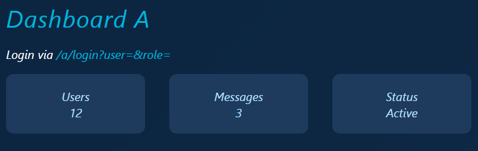
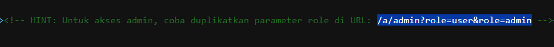
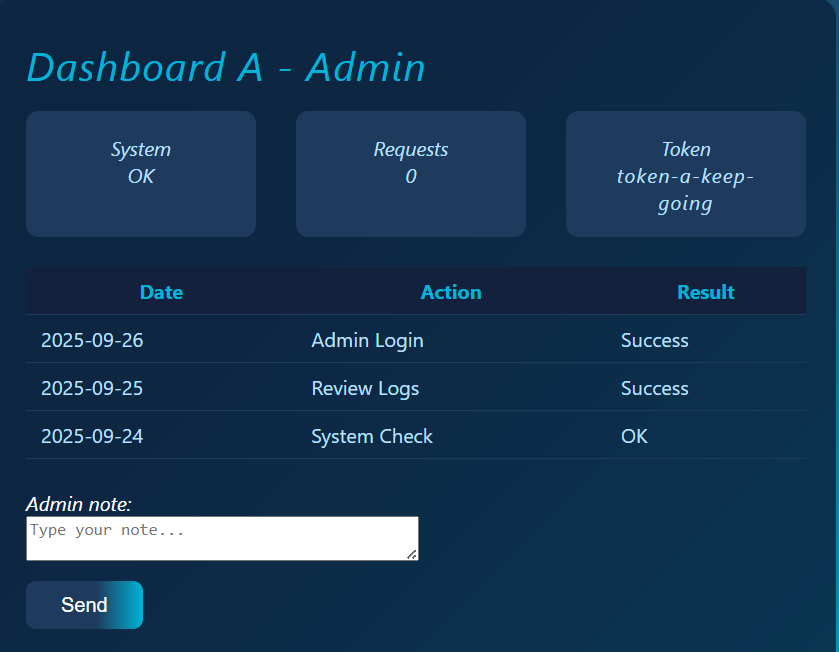
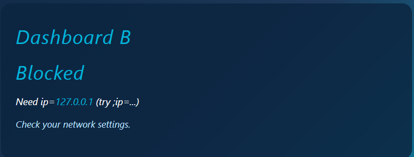
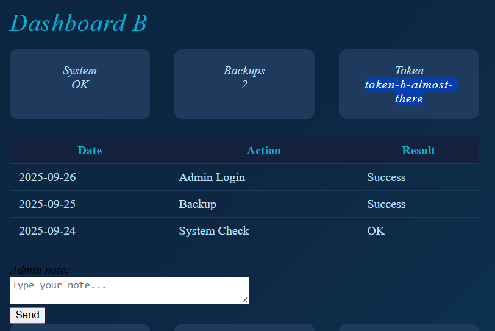
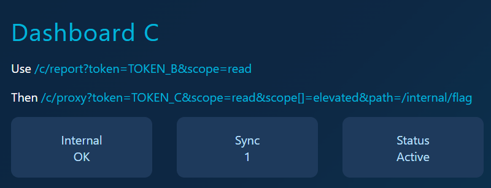
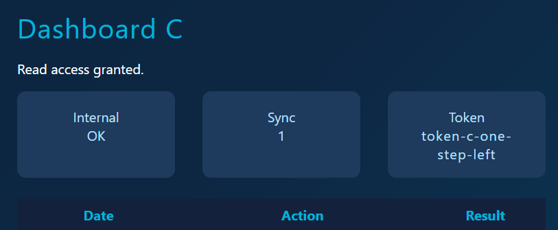
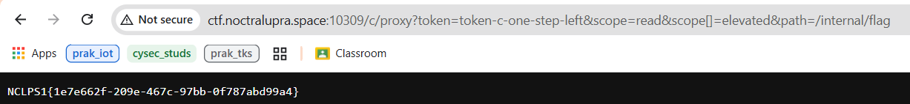

## hpp apipipipipipi
**Difficulty:** Easy
**Author:** xixixi
**URL:** 
/a/ -> http://ctf.noctralupra.space:10309/a/ 
/b/ -> http://ctf.noctralupra.space:10309/a/ 
/c/ -> http://ctf.noctralupra.space:10309/a/

### Description
katanya si secure, 3 dashboard /a/ /b/ /c/, tapi ya... masih pake http 1

### Solution

Dari tampilan awal web diberikan hint untuk login via endpoint `/a/login?user=&role=`.

Setelah mengakses endpoint tersebut ditemukan hint pada source code-nya untuk mengakses endpoint `/a/admin?role=user&role=admin`.

Dari endpoint tersebut ditemukan `tokenA : token-a-keep-going`.

Karena tidak ada hal yang bisa diakses lagi dari path `/a/`, saya mencoba mengakses path lain yang diberikan oleh deskripsi chall. Disini saya mencoba mengakses `/b/` dan tampilan webnya memerlukan `ip=127.0.0.1`.

Pada `style.css` ditemukan hint `/panel/?token=...&ip`. Dengan menggunakan token yang didapat dari `/a/`, endpoint panel dapat diakses dan didapatkan `tokenB : token-b-almost-there`.

Ke path selanjutnya `/c/`, tampilan webnya mengarahkan untuk menggunakan `/c/report?token=TOKEN_B&scope=read` dan `/c/proxy?token=TOKEN_C&scope=read&scope[]=elevated&path=/internal/flag`.

Mengakses hint pertama pada `/c/` ditemukan hint untuk menambahkan `scope[]=elevated`. Dengan menambahkan hint tersebut ke url didapatkan `tokenC : token-c-one-step-left`.

Langkah terakhir adalah mengakses `/c/proxy?token=TOKEN_C&scope=read&scope[]=elevated&path=/internal/flag` dengan memasukkan token yang didapat sebelumnya dan flagnya akan muncul.

### Flag
NCLPS1{1e7e662f-209e-467c-97bb-0f787abd99a4}
