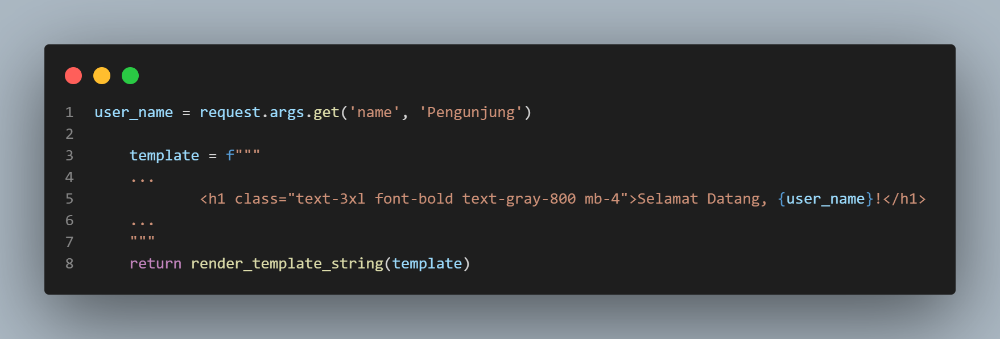
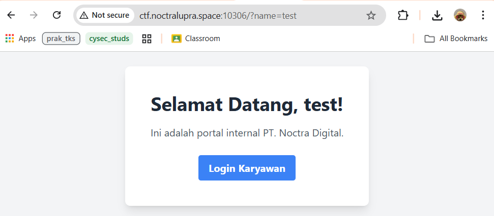
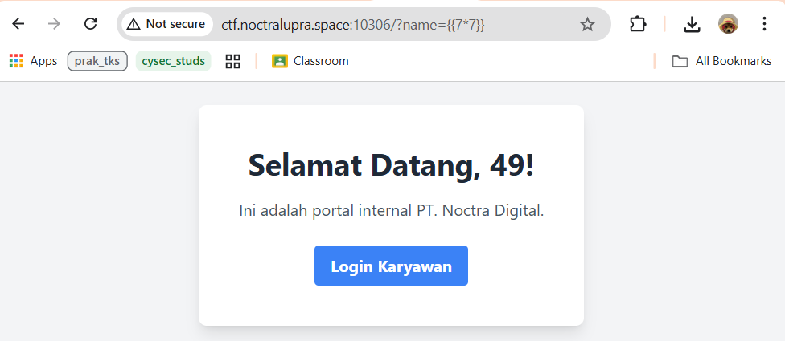
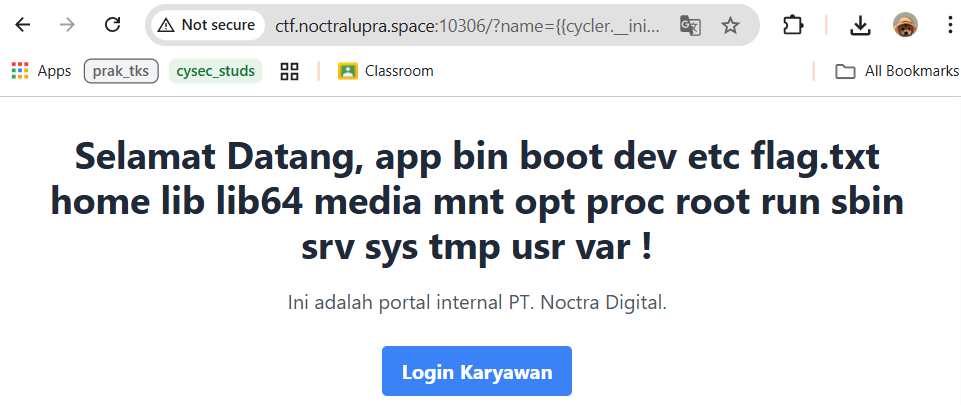

## Internal

**Difficulty:** Easy

**Author:** maul

**URL:** [http://ctf.noctralupra.space:10306](http://ctf.noctralupra.space:10306)

### Description

jangan di bruteforce!

### Solution

Pada challenge ini diberikan source code sederhana yang menjalankan sebuah halaman utama yang menyediakan halaman selamat datang dan login. 



Dari kode terlihat bahwa variabel `user_name` berasal langsung dari `request.args.get('name', 'Pengunjung')` dan kemudian dimasukkan ke dalam template HTML lalu dirender menggunakan `render_template_string`.



Langkah berikutnya saya melakukan pengujian sederhana dengan parameter `?name=test` untuk memastikan nilai tersebut muncul di halaman karena pada akses awal tidak ditemukan parameter apapun di welcome page. 



Dari situ saya mencoba payload SSTI `{{7*7}}` pada parameter `name` untuk menguji apakah template akan dievaluasi. Hasilnya payload tersebut dieksekusi dan mengonfirmasi adanya celah SSTI.

Dari sini saya melakukan RCE. Payload yang saya pakai adalah sebagai berikut:

```text
?name={{cycler.__init__.__globals__.__builtins__.__import__('os').popen('ls /').read()}}
```



Dengan payload tersebut, web mengeksekusi perintah `ls /`. Ditemukan file flag.txt dan ubah perintah menjadi `cat flag.txt` untuk membaca flagnya.

```text
?name={{cycler.__init__.__globals__.__builtins__.__import__('os').popen('cat /flag.txt').read()}}
```

### Flag

NCLPS1{hidd3n_ssti_xd}