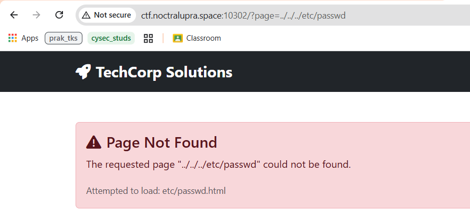
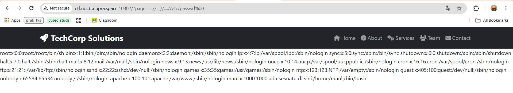
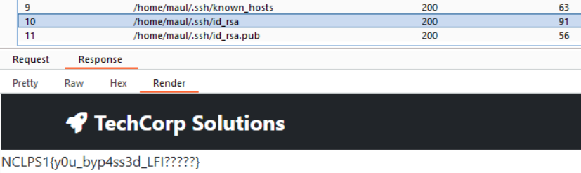

## NewbieDev
**Difficulty:** Medium
**Author:** maul
**URL:** [http://ctf.noctralupra.space:10302](http://ctf.noctralupra.space:10302)

### Description
bro pikir sudah memperbaiki bugnya 😂😂

### Solution


Ketika saya pertama kali mengakses website, saya melihat ada parameter `?page=` yang tampaknya memuat file lokal. 



Percobaan sederhana untuk membaca `/etc/passwd` seperti `?page=../../etc/passwd` gagal dan mengembalikan pesan `Attempted to load: etc/passwd.html`. Aplikasi menambahkan suffix `.html` otomatis ke semua path dan ada filter untuk mencegah `..` langsung, sehingga percobaan path traversal standar gagal. Langkah berikutnya adalah mencari cara melewati filter dan menghilangkan efek `.html` yang ditambahkan.

Dari eksperimen, saya menemukan bahwa server mengabaikan null byte yang di-URL-encode menjadi `%00`. Dengan menambahkan null byte sebelum ekstensi yang dipaksakan, trailing `.html` diabaikan oleh fungsi pemroses file (karena string di-terminate oleh null byte pada beberapa implementasi), sehingga kita bisa membaca file yang sebenarnya. Selain itu, ada mekanik filtering yang membuat `..` diblokir jika ditulis normal, sehingga saya menggunakan teknik pengulangan `....//` (empat titik kemudian dua slash) yang sering dipakai untuk mengelabui filter berbasis regex sederhana yang hanya mendeteksi `..` literal.

Dengan pemahaman ini, payload yang efektif menjadi seperti:

```
http://ctf.noctralupra.space:10302/?page=....//....//....//etc/passwd%00
```



Dari sini `etc/passwd` berhasil ditampilkan, sehingga teknik LFI (Local File Inclusion) dengan null byte berhasil. Dari isi `/etc/passwd` didapatkan hint tentang user `maul` dan home-nya di `/home/maul`. 



Karena saya gagal mengakses file - file yang biasa ada di ctf (flag, flag.txt, flag.html), saya melakukan bruteforce dengan burp intruder dengan wordlist https://gist.github.com/Mayfly277/63cce795df23f21b86aefa84ce9171e1. Dan flag ditemukan pada file /home/maul/.ssh/id_rsa.

### Flag
NCLPS1{y0u_byp4ss3d_LFI?????}
