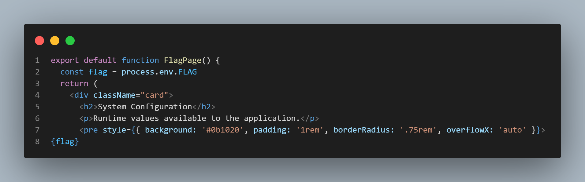
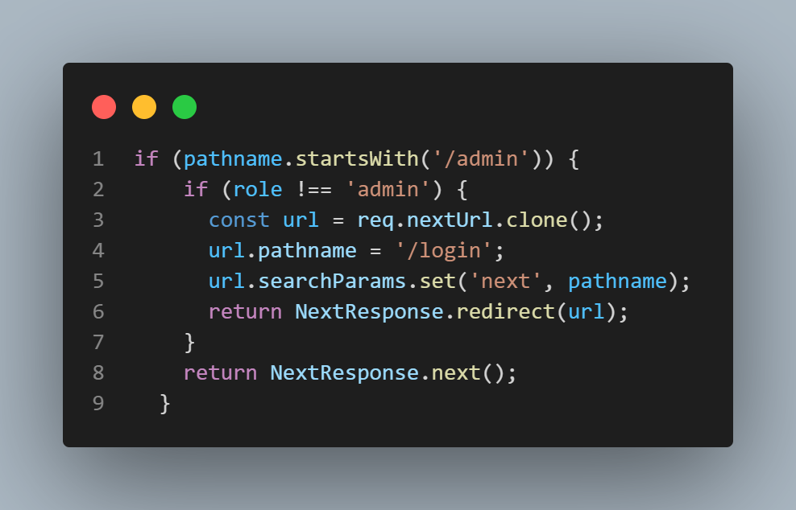
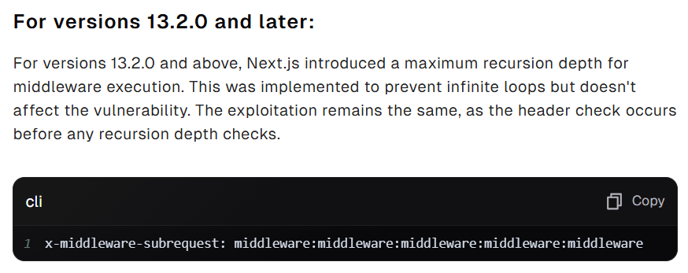
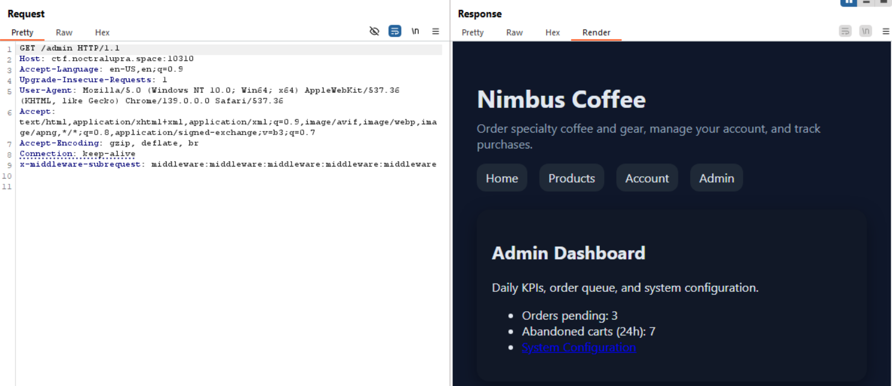
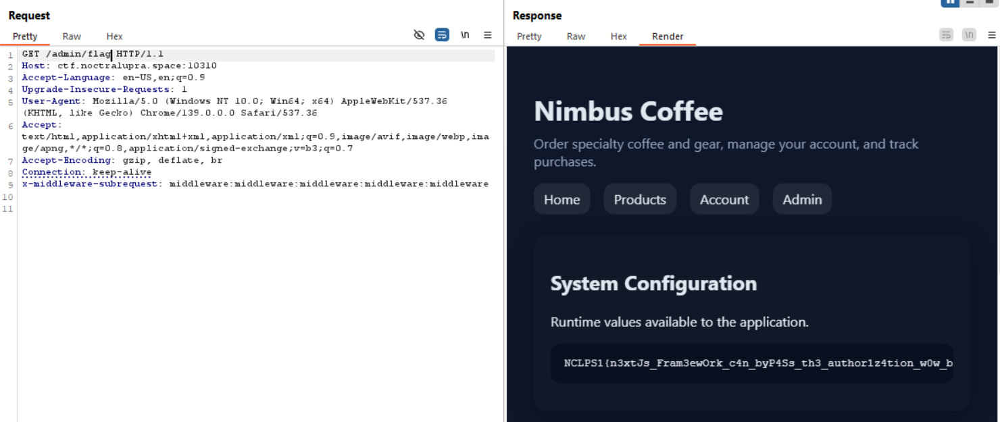

## Nimbus Coffee
**Difficulty:** Easy
**Author:** moonetics
**URL:** [http://ctf.noctralupra.space:10310](http://ctf.noctralupra.space:10310)

### Description
Pemilik toko baru membaca kabar tentang CVE terbaru yang memengaruhi framework web yang digunakan situs ini. Tolong selidiki apakah aplikasi kami rentan dan buktikan dampaknya dengan mengakses konfigurasi sistem yang seharusnya hanya dapat diakses admin.

### Solution

Saya mulai dengan meninjau source code yang disertakan. Dari `app/admin/flag/page.tsx` terlihat halaman yang menampilkan config web, di mana nilai `process.env.FLAG` dirender langsung ke halaman.

Langkah berikutnya saya baca middleware (`middleware.ts`) dan struktur routing aplikasi Next.js. Dalam kode middleware terlihat otorisasi yang memeriksa `role` pada user sebelum mengizinkan akses ke path `/admin`.

Ditemukan [CVE](https://projectdiscovery.io/blog/nextjs-middleware-authorization-bypass)-nya yaitu dengan memanfaatkan header `x-middleware-subrequest`. Tekniknya mengirimkan permintaan dengan header khusus yang membuat Next.js menganggap permintaan tersebut berasal dari subrequest internal sehingga melewati logika otorisasi middleware.

Dari sini saya menggunakan payload dengan request yang menambahkan header `x-middleware-subrequest: middleware:middleware:middleware:middleware:middleware`. Dengan begitu path `/admin` tidak diproses oleh middleware otorisasi dan halaman admin dapat diakses.

Flag berada di path /admin/flag.

### Flag
NCLPS1{n3xtJs_Fram3ewOrk_c4n_byP4Ss_th3_author1z4tion_w0w_b45d5b6c57}
