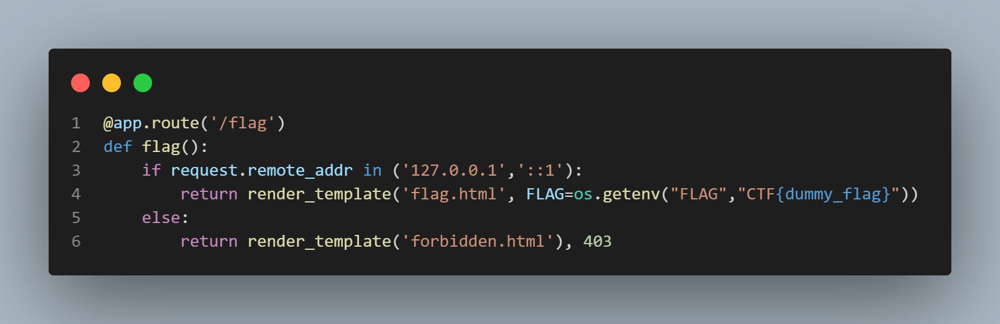
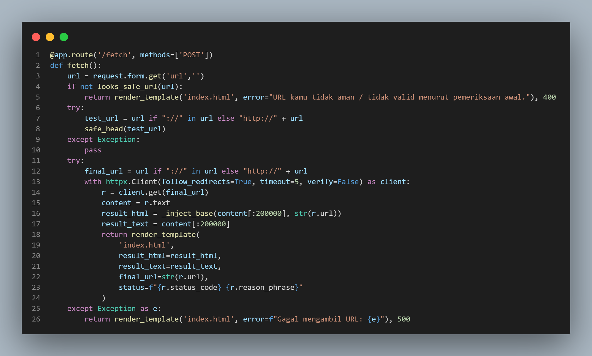
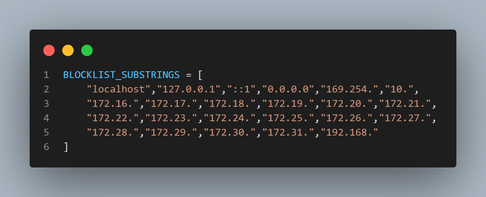
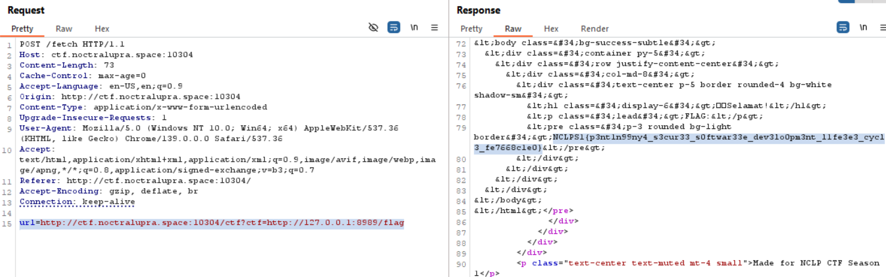

## Request Failure

**Difficulty:** Easy-Medium

**Author:** moonetics

**URL:** [http://ctf.noctralupra.space:10304](http://ctf.noctralupra.space:10304)

### Description

Karena banyak website yang tidak bisa dibuka, jadi aku memutuskan untuk membuat proxy sendiri.

### Solution



Pada source codenya, saya menemukan bahwa ada endpoint `/flag` yang sebenarnya mengembalikan isi flag, tetapi endpoint itu hanya mengizinkan akses dari `localhost`.



Dari source code dan web, terdapat mekanisme yang menerima parameter URL untuk melakukan fetch ke alamat lain. 



Server juga menerapkan block list sehingga tidak bisa langsung melakukan fetch ke localhost untuk mendapatkan flagnya. 

Namun fungsi proxy ternyata tidak memverifikasi asal target sepenuhnya saat parameter yang dikirim adalah sebuah URL yang berisi URL lain sebagai sub-parameter, ini membuka peluang untuk `request chaining`.

Dengan begitu, saya membuat payload yang memanfaatkan parameter chaining. 
- meminta server untuk memanggil endpoint internal miliknya sendiri (`/ctf`) 
- pada panggilan tersebut menyisipkan parameter `ctf` yang berisi URL internal `http://127.0.0.1:8989/flag`. 
- alur permintaannya menjadi server -> server -> 127.0.0.1:8989/flag. Payload yang saya gunakan:

```
http://ctf.noctralupra.space:10304/ctf?ctf=http://127.0.0.1:8989/flag
```

Web meresponse dengan menampilkan flagnya.


### Flag

NCLPS1{p3nt1n99ny4_s3cur33_s0ftwar33e_dev3lo0pm3nt_l1fe3e3_cycl3_fe7668c1e0}