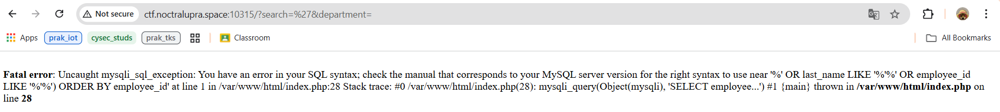
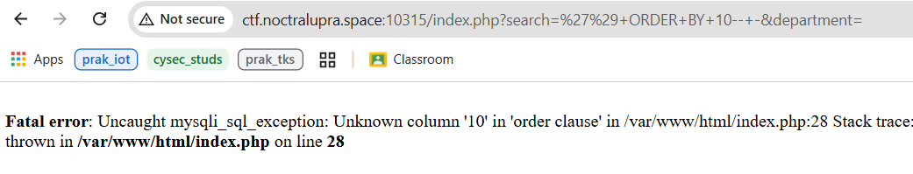
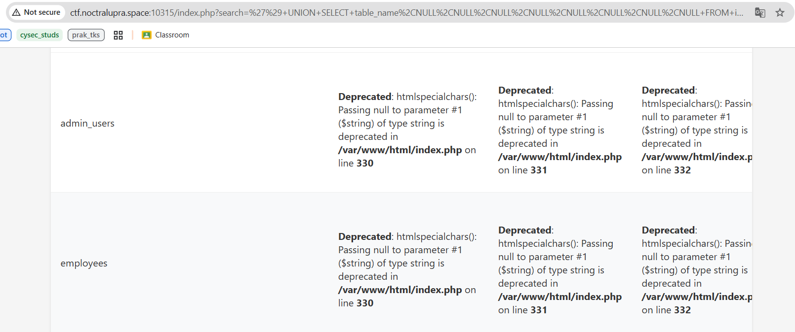
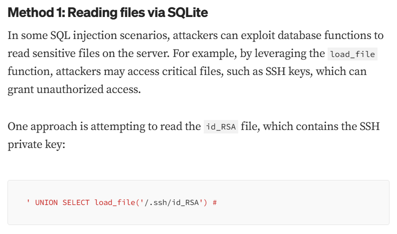
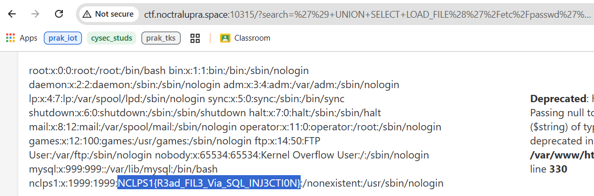

## sequel

**Difficulty:** Easy

**Author:** maul

**URL:** [http://ctf.noctralupra.space:10315](http://ctf.noctralupra.space:10315)

### Description

### Solution

Web menyediakan form login dan sudah menyiapkan kredensial-nya. Setelah login akan ditemukan fitur search dan apabila memasukkan `'` maka akan terjadi `mysql error`

Dari judul chall juga, mengisyaratkan kalau ini adalah chall sqli. Saya melakukan Union Based Attack terlebih dahalu menggunakan payload ORDER BY. Web mengalami error ketika `') ORDER BY=10-- -`, yang artinya jumlah kolom yang ada adalah 9 kolom.

Dengan begitu, dapat dilakukan eskalasi dengan Union Select dengan payload `') UNION SELECT table_name,NULL,NULL,NULL,NULL,NULL,NULL,NULL,NULL FROM information_schema.tables-- -` untuk mengekstrak variabel - variabel yang ada pada database. Disini saya mengekstrak dahulu nama table yang ada pada database. Ditemukan table admin_users dan employees.

Sayangnya, dari kedua table tersebut tidak ada yang menampilkan flagnya secara langsung. Disini saya mencoba mencari bisa eksalasi kemana saja sqli itu. Dan ternyata, melihat referensi dari [https://medium.com/@0x3adly/from-sql-injection-to-rce-leveraging-vulnerability-for-maximum-impact-2fb356907eed](https://medium.com/@0x3adly/from-sql-injection-to-rce-leveraging-vulnerability-for-maximum-impact-2fb356907eed), sqli bisa dieskalasi ke LFI juga menggunaka payload `' UNION SELECT LOAD_FILE('namafile.txt')-- -`.

Dengan begitu, saya mencoba mengakses file `/etc/passwd` menggunakan payload `') UNION SELECT LOAD_FILE('/etc/passwd'),NULL,NULL,NULL,NULL,NULL,NULL,NULL,NULL-- -` dan disana didapatkan flagnya.

### Flag

NCLPS1{R3ad_FIL3_Via_SQL_INJ3CTI0N}